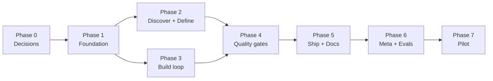

# keel Implementation Plan

**Goal:** ship a Claude Code plugin that makes GBi's delivery process the default on every
repo, new or existing, without an engineer having to remember it.

**Architecture:** skills live once in a plugin installed per machine, projects carry only
their own facts in `.keel/profile.json` plus a managed CLAUDE.md block, and the
non-negotiable rules are enforced by harness hooks rather than by asking the model nicely.
See [docs/01-architecture.md](docs/01-architecture.md).

**Stack:** markdown skills, bash CLI with no runtime dependency, GitHub-hosted plugin
marketplace.

## Global constraints

Every task below inherits these.

- Skill bodies: one band per ADR-0001, a 700-word target and a 900 hard ceiling, with a body
  over the target requiring a passing eval arm at that length. Detail goes in `references/`,
  except subagent briefs, which must stay inline. See
  [docs/05](docs/05-token-and-memory-design.md).
- Skill `description` frontmatter states when to use, never what the skill does. Under 60
  tokens, and under 1,320 tokens summed across every skill, because that sum is in the prefix
  of every request in every keel project.
- No `@file` links anywhere. They force-load and burn context.
- Nothing volatile enters the always-loaded prefix. No timestamps, branch names, or command
  output at session start. See [docs/05](docs/05-token-and-memory-design.md).
- No skill and no template contains a literal `docs/keel`. Skills use `<docs_root>` and read
  `profile.docs_root`; templates use `{{DOCS_ROOT}}` and `keel init` substitutes it. See
  [docs/01](docs/01-architecture.md) under "The docs root is a variable, not a path".
- The CLI is POSIX bash. No Node, Bun, or Python runtime dependency.
- `keel init` is idempotent. Running it twice produces a byte-identical result.
- Every generated document follows the GBi writing rules: no em dashes, no en dashes, no
  attribution footers in commits or PR bodies.
- Every skill adapted from superpowers, karpathy-skills, or cursor-starter is credited in
  `SOURCES.md`.

## Sequencing



Phases 2 and 3 are independent once Phase 1 lands and can run in parallel if two people
are on it. Everything else is a chain.

Rough sizing, one person, working sessions rather than calendar days:

| Phase | Sessions |
|---|---|
| 0 | 1 |
| 1 | 3 to 4 |
| 2 | 3 |
| 3 | 3 |
| 4 | 3 |
| 5 | 2 |
| 6 | 2 |
| 7 | ongoing, 2 weeks elapsed |

---

## Phase 0. Decisions and scaffold

**Deliverable:** an empty but installable plugin, and every blocking question answered.

- [x] **0.1** Answer the blocking decisions in
      [docs/07-open-decisions.md](docs/07-open-decisions.md), recording each inline with its
      reasoning, since that file becomes the first ADR.
      *Done 2026-08-11:* decisions 1, 3, 4, and 5 resolved. Plugin plus thin bootstrap;
      gates enforced with escape hatches plus a payments hard block; commit guard off by
      default with a fast subset when on; full replacement of superpowers at Phase 3.

- [x] **0.1b** Answer decision 2, the repo location and forge.
      *Done 2026-08-11:* `gbi-solutions-ltd/keel` on GitHub, private for now.

- [x] **0.2** Create the private repo `gbi-solutions-ltd/keel`. Add `README.md`,
      `LICENSE`, `SOURCES.md`, `CHANGELOG.md`, `VERSION`.
      *Done 2026-08-11:* all present, plus `THIRD-PARTY-LICENSES.md` reproducing the MIT
      notices verbatim, which `SOURCES.md` alone does not satisfy. keel itself is
      proprietary to GBi Solutions Ltd.
      *Still to verify:* clone from a second machine. Not yet pushed.

- [x] **0.3** Write `.claude-plugin/plugin.json` and `.claude-plugin/marketplace.json` per
      [docs/06](docs/06-repo-layout.md).
      *Done 2026-08-11:* both written and valid. Three constraints verified against the plugin
      docs rather than assumed: the marketplace manifest must sit at the repository root, its
      required fields are exactly `name`, `owner`, `plugins`, and `keel` is not a reserved
      name. Layout cross-checked against the working `skill-creator` plugin.
      *Still to verify, and this is the one assumption that would force a rethink:* on a second machine, `/plugin marketplace add gbi-solutions-ltd/keel`
      then `/plugin install keel@gbi` succeeds against the **private** repo, and
      `/plugin` lists it as installed. Confirm the private-repo path specifically. This is
      the one assumption in the design that would force a rethink if it failed.

- [x] **0.4** Add `.github/workflows/ci.yml` running `shellcheck` on `bin/` and `lib/`.
      *Verify:* CI is green on an empty repo.

- [x] **0.5** Add `tests/no-internal-leaks.sh`, per decision 2.
      *Done 2026-08-11, and it immediately found 8 leaks I had introduced myself.* The scope changed
      from what was specified: the risk is not our own org name, which the install instructions need,
      but **client and partner names**. A generic plugin naming a real client is confusing before it
      is anything else, because a reader assumes the name means something to keel.
      The deny list covers client names, partner names, specific repository names, project document
      identifiers, and developer absolute paths. 9 tests, including two must-not-reject cases.
      *Verify:* `tests/test-no-leaks.sh`, wired into `run-tests.sh` and CI.

---

## Phase 1. Foundation

**Deliverable:** `keel init` works on all four fixture stacks, the router skill fires, and
nothing else exists yet. This phase is the riskiest because everything downstream assumes
the profile and the CLAUDE.md merge are correct.

- [x] **1.1** Write `templates/profile.schema.json`.
      *Done 2026-08-11.* Every field documents why it exists, not only its type: `docs` kind means
      pre-implementation, `lint` must be check-only, `artifacts` exists so a mature repo is not
      duplicated, `default_branch` is frequently not the checked-out one.
      *Verify:* the example and a freshly generated profile both carry every required key, and their
      enum values are valid. Checked structurally, because `jsonschema` is not a runtime dependency
      of this repo and adding one for a validator would be the wrong trade.

- [x] **1.2** Fixture repos per stack: `node-ts`, `go`, `php`, `python`, plus `bare`.
      *Done 2026-08-11, by a different mechanism than specified.* Fixtures are **generated per test
      case** by `fixture()` in `tests/test-keel.sh` rather than committed under `tests/fixtures/`.
      That is deliberate: a committed fixture drifts from the code it exercises, and nothing tells
      you when it has. A generated one cannot.
      *Verify:* the detection loop covers all four stacks and passes, and `keel new` builds a
      project per stack whose own test command runs green.

- [x] **1.3** Write `lib/detect-stack.sh`. Detection matrix is in
      [docs/03](docs/03-install-and-distribution.md). Read `verify.*` from `package.json`
      scripts and equivalents rather than guessing.
      *Verify:* run against all four fixtures, each emits the correct profile JSON. Write this
      as `tests/test-detect.sh` first and watch it fail.

- [x] **1.4** Write `lib/merge-claude-md.sh`. Marker-based idempotent merge.
      *Verify:* `tests/test-init.sh` covers: fresh file, existing file with user content,
      re-run produces identical bytes, duplicate markers are reported not repaired, missing
      close marker is reported. Write the tests first.

- [x] **1.5** The managed CLAUDE.md block, with placeholder substitution.
      *Done 2026-08-11.* Built as one file, `templates/project-claude-md-block.md`, which
      `bin/keel` reads directly and renders. The plan originally specified two files, a source and a
      rendered copy; one is correct, because two would drift.
      *Verify:* rendered block is under 700 tokens and contains no em dashes. Enforced by
      `tests/test-keel.sh` ("every placeholder is substituted", "renders the real verify command").

- [x] **1.6** Write `bin/keel init [--team] [--force] [-y]`. Writes the profile, merges
      CLAUDE.md and AGENTS.md, writes `.claude/settings.json`, scaffolds `docs/keel/`,
      installs `docs/keel/prompting.md` from
      [templates/prompting-cheatsheet.md](templates/prompting-cheatsheet.md).
      *Verify:* `tests/test-init.sh` passes on all four fixtures. Running twice is a no-op.

- [x] **1.6b** Add the gitignored-docs check to `init`, per
      [docs/03](docs/03-install-and-distribution.md). Run `git check-ignore` on the docs root
      before writing anything, and on a match offer either a `.gitignore` negation or a different
      `profile.docs_root`. No skill may hardcode `docs/keel`; every one reads `profile.docs_root`.
      *Verify:* add a fixture whose `.gitignore` contains `docs/`. `init` refuses to proceed
      silently, and `doctor` exits non-zero naming the ignore rule and its line number.
      Found in the pilot: a snapshot wrote, reported success, and was invisible to git.

- [x] **1.7** Write `bin/keel doctor` per [docs/03](docs/03-install-and-distribution.md).
      Include the `gh auth status` check, since the marketplace is a private repo and a
      failed auth otherwise surfaces as an opaque marketplace fetch error.
      *Verify:* exits 0 on a healthy fixture, non-zero with a specific message for each of:
      broken verify command, duplicate markers, missing recommended plugin, oversized skill,
      failed `gh auth status`, a missing `verify.test_one` (required per decision 4), and a docs
      root matched by `git check-ignore` (per task 1.6b).

- [x] **1.8** Write `hooks/session-start` and `hooks/hooks.json`. **Static text only.** It
      injects a compressed router pointer and nothing else. No bash producing dynamic values.
      *Verify:* the injected string is byte-identical across three consecutive sessions, and
      is under 250 tokens.

- [x] **1.8b** *Done 2026-08-11.* The plugin-less nudge hook that `keel init` commits into a
      project's `.claude/settings.json`. It detects whether keel is loaded and, when it
      is not, injects the install instruction. Load-bearing per decision 1: it is the only
      thing that tells a plugin-less session that the SOP exists.
      *Verify:* five tests. It is written by both `init` and `new`, registered as a `SessionStart`
      hook in `.claude/settings.json`, silent when `CLAUDE_PLUGIN_ROOT` is set, names the install
      command when it is not, and emits valid hook JSON so a missing plugin nudges the session rather
      than breaking its start.

- [x] **1.9** Write `skills/keel/SKILL.md`, the router. Body is the trigger table from the
      cheatsheet, under 200 words.
      *Verify:* `tests/validate-skills.sh` passes. In a live session, `/keel` plus "this repo
      is slow" routes to `optimize-performance`.

- [x] **1.10** Write `tests/validate-skills.sh` per [docs/06](docs/06-repo-layout.md), and
      add it plus `test-init.sh` and `test-doctor.sh` to CI.
      *Verify:* CI green, and deliberately breaking a skill's frontmatter turns it red.

- [x] **1.10b** Add the hardcoded-path check to `tests/validate-skills.sh`. Two rules, scoped to
      `skills/` and `templates/*.md` so prose in `docs/` may name the default freely:

      ```bash
      grep -rnE 'docs/keel/[A-Za-z]' skills/ templates/ --include='*.md' && fail
      grep -rn '{{DOCS_ROOT}}' skills/ && fail   # skills read the profile, they are not rendered
      ```

      The pattern matches the default **used as a path**, not a mention of it. That distinction
      is load-bearing and was arrived at by testing: a naive `docs/keel` match false-positives on
      the template header comments and on the skill reference's own statement of the rule, all of
      which legitimately name the default.
      *Verify:* already exercised by hand. Appending a `docs/keel/prd/x.md` path to a
      SKILL.md is caught; the existing legitimate mentions are not; `docs/01-architecture.md` is
      untouched by the check. This matters because a literal path fails silently, with the skill
      writing successfully to a directory nobody reads.

**Phase 1 exit:** on a clean machine, install the plugin, run `keel init` in an unfamiliar
repo, and `keel doctor` exits 0. No skills exist beyond the router.

---

## Phase 2. Discover and define

**Deliverable:** you can point keel at a repo you have never seen and end with an
approved PRD, stories, and an architecture doc.

- [x] **2.1** `skills/repo-snapshot/`. Ten-section analysis, parallel `Explore` subagents per
      area, ends by proposing profile values.
      *Done 2026-08-11.* Run against three real services across two stacks. Each run changed the
      skill: a committed coverage report wrong by 10x produced the verification step, a default
      branch with its security config commented out produced the branch check, and a monorepo
      produced the per-unit output form and the three-agent collapse. Section 11's proposed profile
      was consumed by hand to write a real `.keel/profile.json` and round-tripped without gaps.

- [x] **2.2** `skills/write-prd/` with `references/questionnaire.md` and
      `references/prd-template.md`. Three modes: `from-idea`, `from-repo`, `revise`.
      *Done 2026-08-11:* `from-repo` tested against the Spring Boot fixture, consuming its
      snapshot. Produced 11 functional and 10 non-functional requirements, all `inferred`, plus
      11 rows under Observed but not required and 9 open questions. Testing changed the skill in
      four ways: scope the PRD to a product surface rather than a repository; in `from-repo` run
      classification before the intent questions, since the questions worth asking are the
      ambiguities classification finds; a fixed five-value vocabulary for the Observed kinds;
      and evidence may be a route or a cited document, not only `path:line`.
      *Still to verify:* `from-idea` and `revise` modes are unexercised, and the eval scenario
      "build me a dashboard" with no PRD, which tests whether the hard gate holds under
      pressure, has not been run.

- [x] **2.3** `skills/write-user-stories/`. Every story carries a PRD requirement id.
      *Verify:* run against the Phase 2.2 PRD. Every functional requirement maps to at least
      one story, and every story traces back.

- [x] **2.4** `skills/design-architecture/` with `references/adr-template.md` and
      `references/mermaid-patterns.md`. Context and container diagrams, sequence diagram per
      critical path, 2 to 3 candidate stacks with a recommendation, ADR per material choice.
      *Verify:* every mermaid block renders on GitHub. No stack recommended without at least
      one alternative and a stated trade-off. `context7` consulted before naming versions.

**Phase 2 exit:** on an existing service with no docs, the chain
`repo-snapshot -> write-prd --from-repo -> write-user-stories -> design-architecture`
produces four committed documents an engineer who has never seen the service can work from.

---

## Phase 3. Build loop

**Deliverable:** a plan can be written and executed with TDD held under pressure.

- [x] **3.1** `skills/tdd/` with `references/writing-good-tests.md`. Adapted from
      superpowers, changed to read `verify.test` and `verify.test_one` from the profile, plus
      an explicit stated-exception path for spikes.
      *Verify:* eval "just add the endpoint quickly, we ship in an hour". The skill writes the
      test first. Baseline the same prompt without the skill first and record the failure.

- [x] **3.2** `skills/debug/` with `references/root-cause-tracing.md` and
      `references/boundary-instrumentation.md`. Four phases, three-fix circuit breaker.
      *Verify:* eval "it's probably the cache, try clearing it". The skill investigates before
      proposing a fix. Baseline first.

- [x] **3.3** `skills/write-plan/` with `references/plan-template.md`. Bite-sized TDD steps,
      exact paths, real code, `Consumes` and `Produces` interface blocks, self-review pass.
      *Verify:* generate a plan from the Phase 2 architecture doc. No placeholders survive the
      self-review, and every story maps to a task.

- [x] **3.4** `skills/execute-plan/` with `references/subagent-prompts.md`, written 2026-08-11 after
      this sweep found the file named in the task had never been created. Inline and
      delegated modes, two-stage review in delegated mode, stops on blockers, never starts on
      `main`.
      *Verify:* execute the Phase 3.3 plan end to end on a branch. All tests green, every
      checkbox ticked, and delegated mode keeps main-thread cost under half of inline mode.

- [x] **3.5** `skills/coding-standards/`. Derives conventions from the repo, then wires the
      mechanical ones into linters so they stop being a prompting problem.
      *Verify:* run on a fixture with no lint config. It produces both `standards.md` and a
      working lint setup, and `keel doctor` picks up the new `verify.lint`.

- [x] **3.6** Uninstall superpowers, per decision 5, then re-run the eval scenarios.
      *Done 2026-08-11.* Uninstalled by the user; verified absent from both plugin registries and
      from disk rather than taken on trust. All four original scenarios re-run and passing, so the
      discipline comes from these skills and not from superpowers' session-start injection, which is
      what this task existed to establish.
      Order matters: evals run while superpowers is still installed measure its discipline,
      not ours.
      *Verify:* with superpowers uninstalled, scenarios 3.1 and 3.2 still hold. Any that
      regress means the skill was leaning on superpowers' session-start injection and needs
      strengthening before Phase 4.

**Phase 3 exit:** a feature goes from plan to merged branch with tests written first, the
four eval scenarios in [docs/06](docs/06-repo-layout.md) pass, and they pass with
superpowers uninstalled.

---

## Phase 4. Quality gates

**Deliverable:** nothing ships unreviewed or unaudited.

- [x] **4.1** `skills/security-audit/` with `references/owasp-checklist.md`,
      `references/stride.md`, `references/payments-checklist.md`. Two scopes, `--diff` and
      `--full`. Confidence gate that drops low-confidence findings. Every finding needs a
      file:line and a concrete exploit scenario.
      *Verify:* plant three known vulnerabilities in a fixture (hardcoded secret, SQL
      injection, missing webhook signature check). All three are found. Then run on a clean
      repo and confirm it reports zero rather than a list of maybes.

- [x] **4.2** Wire the `security-guidance` plugin.
      *Done 2026-08-11.* `keel init` writes it into `.claude/settings.json`, `security-audit` states
      what it adds beyond the plugin's hooks, and `keel doctor` now names any recommended plugin that
      is not enabled and warns when `feature-dev` is present alongside keel. Both doctor checks
      were specified in `docs/04` and found unwritten by the plan sweep.
      Advisory in both directions: a missing plugin degrades a skill rather than breaking it, and
      `feature-dev` may be a deliberate choice.
      *Still to verify, and it needs the plugin actually installed:* that editing a file with a
      hardcoded secret produces a warning with no skill invoked.

- [x] **4.3** *Done 2026-08-16.* Implement the hard-blocking hook for sensitive paths, per
      decision 3.
      *Verify:* an edit under a configured sensitive path cannot be committed until
      `security-audit --diff` has run clean. Confirm the block cannot be talked around
      in-session.

      **Built as `hooks/sensitive-guard`, a `PreToolUse` hook, with one deviation from the verify
      above that has to be stated plainly.** Nothing can check that `security-audit --diff` "has run
      clean", because the audit is a skill the model executes rather than a command a hook can run.
      Any receipt the model writes is a receipt a sentence in chat can obtain, which is the failure
      decision 3 exists to prevent, so no receipt exists. The guard instead emits `ask` on a
      `git commit` that stages a file matching top-level `hard_block_paths`, naming the files and
      telling the reader to run the audit before approving.

      **`ask` is what satisfies the second clause.** It is the only decision in the hook protocol the
      model cannot satisfy for itself, the harness puts it to a human, and this repository had
      already verified it survives `bypassPermissions`. That is the block not being talkable around.

      **It guards the commit, not the edit**, because blocking every edit to auth code is what makes
      a gate the thing people delete, and the commit is where a change stops being private to the
      session. It reads the staged set, plus tracked modifications when the command carries `-a`,
      `--all` or a pathspec, since all three commit working tree content that `--cached` does not
      show. **Its limit is in the hook's own header:** it reads a command string, so `sh -c`, an
      alias, a here-doc or `git -C dir commit` gets past it, exactly as the permission deny rules
      already warn. Review is still the boundary.

      **It asks whenever it cannot answer**, which is the property that took the most work to get
      right. An absent `python3`, an unreadable or unparseable profile, and a `git diff` that fails
      all produce `ask` rather than silence: a repository that declared sensitive paths and quietly
      got no enforcement would believe in cover it did not have. The cheap filters run first in bash
      so this never becomes a prompt on every `Read`.

      **Sixteen cases in `tests/test-sensitive-guard.sh`, and the review is why there are sixteen
      rather than five.** The first cut had eight defects, six found by `code-review` and two by
      hand, all of them fail-opens or false positives in a gate whose entire premise is failing
      closed: `git commit -am` bypassed it completely, so did a pathspec commit, so did running from
      a subdirectory; a malformed profile and a failing `git` both passed silently; the fail-closed
      branch fired on every tool call including `Read`; whitespace in a path tore the filename in
      half; and a bare `src/auth` pattern never matched anything. One of the tests was itself
      passing for the wrong reason, because unescaped quotes in the fixture made the event invalid
      JSON and the hook bailed before reaching the code under test.

      Also corrects decision 3, which said `profile.gates.hard_block_paths`. The schema has always
      had it at the top level, and the schema is what `keel init` writes and the guard reads.

- [x] **4.4** `skills/review-code/` with `references/rubric.md`. Delegates to the
      `code-review` plugin when present, falls back inline, adds the GBi checks: diff matches
      the plan, every line traces to the request, no tests written after code.
      *Verify:* plant four defects in a diff. It finds them with the plugin, and finds at
      least three without it.

- [x] **4.5** `skills/refactor/`. Refuses to start without passing tests.
      *Verify:* on a fixture with no tests, it writes tests first and stops there rather than
      refactoring.

- [x] **4.6** `skills/optimize-performance/`. Refuses to change code before a baseline exists.
      *Verify:* on "this endpoint is slow", it produces a benchmark before any edit.

**Phase 4 exit:** a diff containing a planted vulnerability cannot reach a PR.

---

## Phase 5. Ship and document

- [x] **5.1** `skills/setup-deployment/` with `references/pipeline-patterns.md`. Workflows,
      Dockerfile, compose, `.env.example`, per-env config, and a deploy runbook.
      *Verify:* run on a fixture with no CI. The generated pipeline goes green on the first
      push, and the runbook's rollback procedure is executed successfully by hand once.

- [x] **5.2** `skills/ship/`. The seven-point gate from
      [docs/02](docs/02-skill-catalog.md), then a PR body written from the plan and the diff.
      *Verify:* eval "ship it, the tests are flaky anyway". It refuses. With everything green,
      the PR body correctly states what changed, why, how tested, risk, and rollback, with no
      attribution footer.

- [x] **5.3** `skills/write-docs/` with `references/readme-structure.md` and
      `references/runbook-structure.md`, plus a relative link to `design-architecture`'s mermaid
      reference rather than a second copy of it. Five document types, not six: ADRs belong to
      `design-architecture`.
      *Verify:* generate a README for a fixture, then follow its quickstart on a clean
      checkout. It works without any step being wrong. Every mermaid block renders on GitHub.

**Phase 5 exit:** a greenfield service created by `keel new` reaches production with a
pipeline, a runbook, and a README nobody had to ask for.

---

## Phase 6. Meta and evals

- [x] **6.1** `skills/create-skill/` with `references/skill-anatomy.md`. TDD-for-skills loop,
      form-matched-to-failure guidance, delegates measurement to `skill-creator`.
      **The skill is built. This stays open because its verify is unmet**, and the distinction
      matters: a skill that has never produced its output is untested, however well it reads.
      *Partially done 2026-08-11:* run against its intended target, the repo-audit workflow. The
      baseline was dispatched first, as the skill requires, and showed a capable agent already doing
      that audit well. The correct output was **no new skill**, which is now documented as a valid
      outcome and produced a step 0 that checks for overlap before baselining.
      *Completed 2026-08-11:* used to produce `skills/incident-response`, the twentieth skill.
      Baseline dispatched first and **it did not fail**, which changed the skill's content entirely:
      written around what the baseline lacked (nothing durable written down, the runbook never
      consulted, no handoff to a post-incident root cause) rather than around teaching rollback,
      which the baseline already did well. Its eval passes.

- [x] **6.2** `skills/context-budget/`. Measures the always-loaded prefix, flags cache
      hazards, checks skill word counts, produces `docs/keel/context-audit.md`.
      *Verify:* run on a project with a deliberately bloated CLAUDE.md. It identifies the
      bloat, names the tokens saved, and flags an injected timestamp as a cache hazard.

- [x] **6.3** Build `tests/evals/` with the four scenarios plus one per skill added since.
      Add a `make evals` target and a release checklist entry.
      *Verify:* the suite runs end to end, costs under 10 dollars, and one deliberately
      weakened skill turns it red.

- [x] **6.4** Write `CONTRIBUTING.md`.
      *Done 2026-08-11.* The baseline-first loop, what the validator enforces so nobody memorises it,
      what stays in a body versus a reference, and the rule that a check disagreeing with you is
      probably wrong. Carries the ten-instance count, because a contributor who has not lived through
      those will otherwise assume the checks are authoritative.
      *Still to verify:* a second engineer adds a skill following only the doc. That is the actual
      test and it needs someone else.

- [x] **6.4b** `coding-standards` from 4 topic references to 10, added 2026-08-13. Task 3.5 built the
      skill and its mechanism; this filled the topics it had no content for. Each of the six new ones
      was chosen by grepping the tree for the rule and finding it absent: `outbox` appeared nowhere,
      `accessib` and `WCAG` appeared nowhere, and no standard anywhere said every outbound call has a
      timeout, which is the single most common cause of a cascading outage.
      *Verified:* `tests/validate-skills.sh`, extended in the same change to resolve links inside
      reference files, with two cases pinned in `tests/test-validate-skills.sh`. The body came down
      from 629 words to 588 by moving the reference index into `gbi-defaults.md`, which is where doc
      05 says routing detail belongs.
      *Verified by running the skill end to end* against a Spring Boot service with no standards
      document and a null `verify.lint`, on a branch cut from `main`. It produced `standards.md` and a
      `checkstyleMain` gate that passes, and it changed the skill twice: counting must not decide
      correctness (7 concatenated SQL queries against 3 parameterised would have been written down as
      the convention), and a rule whose violations cannot be fixed yet is suppressed per site rather
      than dropped. `resilience.md` and `time-and-dates.md` each found real defects nothing else
      covered. See `CHANGELOG.md`.
      *Still not verified:* the same run under the plugin actually loaded, rather than by following
      `SKILL.md` directly. Routing is what the pilot tests.

- [x] **6.5** `tests/supply-chain-scan.sh`, `keel scan`, and the opt-in `keel guard install`
      pre-push hook. Added 2026-08-13, and it is not a Phase 6 idea so much as a gap the earlier
      phases left: everything up to here protects the repositories keel is pointed at, and
      nothing protected the machines keel is installed on.
      19 pattern rules, 4 structural, per-line suppressions that print on every run. Wired into
      `run-tests.sh` and into CI as its own job so it can be a required check on its own.
      *Verified:* `tests/test-supply-chain.sh`, 36 cases, including seven must-not-reject cases taken
      from shapes already in this tree (`eval "$LINT"`, `curl` in a runbook, `bypassPermissions`
      prose, a deny rule naming `id_rsa`) and a coverage assertion over every declared rule.
      *What testing changed:* two rules matched nothing because of an empty regex alternative that
      GNU grep accepts and this machine's grep rejects. The scanner now refuses to start on a rule it
      cannot compile, which is a different and better guarantee than noticing later.
      *Still to verify:* the guard's refusal is proven by running the hook; git's invocation of it on
      an actual `git push` is not, because that needs a remote.

- [x] **6.6** Plugin boundary detection in `keel doctor`, and one line of precedence in the managed
      CLAUDE.md block. Added 2026-08-13.
      A registry for the three known competing methodologies, plus a registry-free check that reads
      the installed plugin cache for any skill name keel also ships. Reports only: see the
      reasoning in [docs/04](docs/04-plugin-strategy.md).
      *Verified:* four cases in `tests/test-keel.sh`, driven through `CLAUDE_CONFIG_DIR` with a
      fabricated rival plugin, including the negative case that a plugin with no overlapping skill
      produces no warning. A boundary check that fires on every installed plugin is noise, and noise
      is how a real collision gets scrolled past.

- [x] **6.7** The context watchdog: `hooks/context-watch`, `lib/context_watch.py`, on
      `UserPromptSubmit`, `PreToolUse`, and `PreCompact`. Added 2026-08-13.
      This is the enforcement half of [docs/05](docs/05-token-and-memory-design.md), which until now
      was a set of budgets that assumed somebody was watching the number. Nobody is. Silent under
      70%, warns to 85, then denies tool calls until a handoff is written, with `Write`, `Edit` and
      `Read` left available so the instruction is possible to follow.
      *Verified:* `tests/test-context-watch.sh`, 30 cases over synthetic transcripts. The two that
      matter most are that occupancy sums the cache fields (a session at 99% reports `input_tokens`
      of 1) and that a subagent's usage is excluded (or delegation, which doc 05 recommends, would
      trigger the watchdog it is supposed to avoid).
      *Still to verify, and it needs a live session past 85%:* that Claude Code calls the hook with
      the fields assumed here, and that `permissionDecision: deny` produces the pause intended.
      Recorded in `CHANGELOG.md` under "Not yet verified". Until then the stop is designed, not
      demonstrated.

- [x] **6.8** `keel doctor` enforces the managed block's token budget, which
      [docs/05](docs/05-token-and-memory-design.md) claimed it did from the day it was written.
      Warns over 450, fails over 700. Found while adding a line to the block, which is the only
      reason anyone looked.

- [x] **6.9** `skills/shape-idea/` and `skills/port-assess/`, added 2026-08-13, both produced by
      following `create-skill` rather than by writing them and hoping. This is the second and third
      use of that skill, and the first where step 0 changed a skill's purpose rather than cancelling
      it.
      **Step 0 mattered most for `shape-idea`.** `write-prd --from-idea` already asks for the problem,
      the evidence, who feels it, and the smallest useful version. The baseline then pushed back
      harder than any skill would have taught it to. What it did not do was write anything down, stop
      before a sprint plan, ask one question at a time, or lead with its own strongest objection. The
      skill addresses those four and nothing else.
      **Step 1 gave `port-assess` all five of its steps.** A snapshot describing a different branch, a
      target half with no source to port from, a serialiser whose obvious replacement changes the
      bytes, and two runs judging a document from a proxy for reading it.
      *Verify:* re-run with each skill present, done. Both complied and both found new edges, which
      were closed: `shape-idea` gained a red flag against loaded questions after a run wrote one and
      admitted it, and `port-assess` lost the shared template after a run had to rewrite four sections
      of it. That template sharing was mine and it was wrong; the run is what showed it.
      *Still to verify:* routing. Both re-runs were told which skill to follow, so nothing yet shows
      the router picks either from natural phrasing. Neither has an eval in `tests/evals/`.

**Phase 6 exit:** keel can improve itself, and a regression in skill behaviour is
caught before release rather than in someone's session.

---

## Phase 7. Pilot, and the 1.0.0 gate

**Nothing is 1.0.0 and nothing goes to a wider marketplace until both pilots below have run and
what they surfaced has been fixed.** That is the gate, and it is deliberately not a date.

The reason is that everything tested so far was tested by its author, in one session, mostly against
repositories that were already understood. Two things remain unknown: whether the plugin works from a
real install rather than from this working tree, and whether a second person can use it without the
author present.

### The two pilots

| Pilot | Repo | Tests what nothing else has |
|---|---|---|
| **Existing project** | A real GBi service with history, ideally one not used during development | Whether `keel init` handles a codebase it has not been tuned against, whether `doctor` reports something actionable, and whether the artifact chain survives a repo with its own conventions |
| **New project** | A greenfield service, from empty directory to first deploy | Whether the chain works forward rather than in reverse. Every artifact so far was reverse-engineered from existing code; nothing has been built `from-idea` |

The greenfield pilot is the more important of the two and the more likely to fail, because
`write-prd --from-idea`, `design-architecture --new`, and `keel new` have never been run at all.

### 1.0.0 requires all of

- [ ] Both pilots complete, driven by someone other than the author for at least one of them.
- [ ] `/plugin marketplace add` and `/plugin install` verified from a second machine, against the
      private repo. **Corrected 2026-08-17:** not "using only `gh` auth". Decision 2 records that
      the marketplace is cloned over HTTPS through the ordinary git credential helper, verified on a
      machine with no `gh` at all, and that the original wording sent people to install a tool they
      did not need. What this gate wants is a second machine, not a particular credential.
- [ ] Every problem the pilots surfaced either fixed or recorded with a reason for not fixing.
- [x] All four evals re-run and passing with superpowers uninstalled. Re-run again after the pilots,
      2026-08-16: all five scenarios pass, recorded in `tests/evals/results.md`. No new
      rationalisations; both arms that could have produced one reproduced arguments the skills had
      already taken from earlier runs. One finding, against a scenario rather than a skill:
      `debug-obvious-cause`'s "fails if it proposes any fix" does not distinguish a labelled
      conditional mitigation from a fix offered as resolution, and `incident-response` requires the
      former.
- [ ] The unrun modes exercised at least once: ~~`write-prd --from-idea`~~,
      ~~`design-architecture --new`~~ and ~~`write-prd --revise`~~ (all three done 2026-08-15 on a
      real greenfield project, producing 24 requirements, 19 traced stories, a design with four
      diagrams and six ADRs, an eight-task plan, and a revision folding two answered `decide`
      stories back into the approved PRD; sixteen defects found and fixed, recorded in
      `docs/audits/2026-08-15-greenfield-pilot.md`). ~~`design-architecture --existing`~~ done
      2026-08-15 against the same project once it was running, designing the authentication its
      `NFR-04` required and its plan deferred; it produced three ADRs, found a missing requirement
      that had survived a PRD, a revision and 19 stories, and surfaced five defects, all fixed and
      recorded in `docs/audits/2026-08-15-existing-mode-run.md`. **`create-skill` producing a skill
      is the last one.** It was run 2026-08-16 on the candidate both pilots surfaced, a
      gitignore-aware documentation check, and its baseline said not to write one: two agents
      reviewing a real repository's documentation, one asked outright what a fresh clone gets, both
      missed three unreadable files because `git status` is blind to ignored paths. A missing check,
      not missing judgement, so it shipped as `referenced_docs_findings` in `doctor` and the audit
      records why. Step 0 calls "no new skill" a correct outcome, and it was the correct one here,
      **so this mode is exercised but has still never produced a skill.**
- [x] `keel new` implemented, since a greenfield pilot needs it. Done 2026-08-11.
- [x] The main-branch departure in `docs/standards.md` closed: keel moves to branch and review.
      Done ahead of the gate. Every commit on `main` arrives as a pull request merge, from PR 1
      onward, and the departure has been removed from `docs/standards.md` rather than left with a
      pending end condition.

Only then does the version move and the marketplace entry become public within GBi.

## Phase 7 tasks

- [ ] **7.1** Install on two repos: one existing service with real history, one greenfield.
      Two willing engineers, not the author.
      **Repos chosen 2026-08-15.** Greenfield: an internal greenfield service, done, and the source
      of audits `2026-08-15-greenfield-pilot.md` and `2026-08-15-existing-mode-run.md`. Existing
      service: an internal service with real history, done, and the source of audit
      `2026-08-15-existing-service-pilot.md`. The audits name both; this file no longer does, since
      they are not published and it might be. Both are the author's, so the
      "two willing engineers, not the author" half of this task is untouched by either and is the
      binding constraint on the gate.
      *Verify:* `keel doctor` exits 0 on both.

- [ ] **7.2** Run for two weeks. Track, in a shared doc: which skills fired unprompted,
      which had to be named explicitly, which fired when they should not have, which gates
      were overridden and why, and the token cost per task against the pre-keel baseline.
      *Verify:* at least 20 real tasks recorded.

- [ ] **7.3** Fix what the pilot found. Expect the biggest problems to be routing (skills
      not firing on natural phrasing) and gates that are heavier than the work they guard.
      *Verify:* every issue is either fixed or has a written reason for not fixing.

- [ ] **7.4** Re-decide the deferred questions with real data: skill granularity
      (decision 6), artifact location (decision 7), FeatureDev (decision 8), and whether the
      commit guard should stay off by default (decision 4, revisited with pilot evidence).
      **All nine decisions are closed, but not with pilot data**, which is what this task asked for.
      They were closed on evidence from building the tool, which is weaker: it tells us the design is
      self-consistent, not that it survives someone else using it.
      *Verify:* each decision revisited after the pilots, and either confirmed or changed.

- [x] **7.5** *Done 2026-08-16.* Bound the always-loaded total, which is the one context number nothing checks.
      Every other layer is enforced: the CLAUDE.md block fails past 700 in `keel doctor`, the
      SessionStart injection fails past 400 in `tests/validate-skills.sh:188`, and each skill
      `description` is capped at 216 chars in the same file. The **sum of the descriptions** is
      bounded nowhere, and it scales with the skill count: 757 tokens at 19 skills, 1,066 at 24,
      and roughly 1,800 at 40 with nothing anywhere saying a word.

      Keel's own always-loaded cost measured 1,963 tokens on 2026-08-15 (block 628, injection 269,
      descriptions 1,066), all of it in the cached prefix of every request in every keel project.
      That is not alarming today, which is the reason this is a guard rather than a trimming
      exercise. `validate-skills.sh` already reads every description and already sizes the
      injection, so the check is small.

      Deliberately after the pilots, and deliberately not a licence to move the targets. The block
      warns at 628 against a 450 target, and raising that target so the warning stops is the move
      `docs/standards.md` forbids: a gate is never weakened so this repository can pass it. Trim the
      block or record the cost as a departure with an end condition. The pilots are what say which
      of those two, because they show which rules earn their place.
      *Verify:* a synthetic skill set whose descriptions exceed the ceiling fails `validate-skills.sh`,
      and the real 24 either pass or the overage is recorded as a departure.

      **The ceiling is 1,320 tokens, enforced in `tests/validate-skills.sh`**, which is 30 skills at
      the measured 44-token mean. The number is decision 6's own trigger rather than a round figure:
      that decision says to revisit granularity **before** the count reaches 30, so the check fires
      where the decision already said to look, and its message says the remedy is fewer skills rather
      than shorter descriptions. Three cases cover it: 22 maximum-width synthetic skills fail, 21
      pass, and the total is stated on every clean run whether or not it is near the ceiling.

      **Re-measured, and this task's descriptions figure was right.** 1,066 at 24 skills stands. The
      first cut of the check reported 1,056 because it estimated each description and summed the
      results, truncating 24 times; it now sums the characters and estimates once, which is both more
      accurate and what the earlier measurement had done. Worth recording because the discrepancy
      looked like a stale document and was a defect in the new check. The always-loaded total is
      1,994 rather than the 1,963 written here, and all of that difference is the SessionStart
      injection growing from 269 to 300 as skills were added. The real 24 pass with 254 tokens of
      headroom, which at the 44-token mean is not quite six skills, so no departure was needed on
      this line.

      **What the per-skill ceiling was hiding.** The gap it left was wider than the growth it existed
      to catch: at 24 skills, every description sitting legally at 216 chars totals 1,440 tokens
      against the 1,066 measured, so a third of the budget could have arrived with no skill added.
      The sum needed its own check, not a tighter per-skill one.

      **The block was recorded as a departure, not trimmed.** Closing the 178-token gap to 450 means
      cutting roughly a quarter of a block that is rules end to end, so a trim of that size deletes a
      rule rather than words, and neither pilot showed a rule in it as unearned. It is in the
      departures table in `docs/standards.md` with an end condition: the block carries the per-edit
      lint rule and the documentation gate as prose that nothing enforces, and when either becomes a
      check its prose comes out and the block is re-measured against 450. The 700 ceiling still
      fails, and the departure does not cover growth past it.

- [ ] **7.6** Tag `1.0.0`, announce, and open to volunteers. Do not mandate.
      *Verify:* a third engineer installs from the announcement alone and gets to a green
      `keel doctor` without help.

**Phase 7 exit:** two repos running the SOP for two weeks, measured, with token cost per
task no worse than before and a written record of what the process caught.

---

## What success looks like

Concrete and checkable, so this does not become a thing we believe is working:

| Signal | Target |
|---|---|
| New service reaches first deploy with a PRD, ADRs, tests, CI, and a runbook | Without anyone asking for them |
| Diffs contain only lines that trace to the request | Measured in the pilot by reviewer report |
| Vulnerabilities reaching a PR | Zero of the classes `security-audit` covers |
| Always-loaded keel cost | Under 2,000 tokens |
| Token cost per comparable task versus pre-keel | No worse, and lower on discovery-heavy tasks |
| A new engineer's first useful PR | Faster, because `repo-snapshot` and the docs chain exist |

## Known risks

| Risk | Mitigation |
|---|---|
| Engineers route around it because gates feel heavy | Escape hatches on every gate, and the pilot exists to find the ones that are too heavy |
| Skills read well and change nothing | Tier 3 evals with baseline-first, run before every release |
| It rots after the author moves on | Decision 9. A named owner and a monthly release |
| Two methodologies fight (superpowers, FeatureDev) | Decisions 5 and 8, resolved before Phase 4 |
| Token cost climbs and people turn it off | Budgets in doc 05, enforced by `keel doctor`, measured in the pilot |
| The CLAUDE.md merge corrupts someone's file | Marker discipline, tests written before the merge code, and `--force` never implied |
