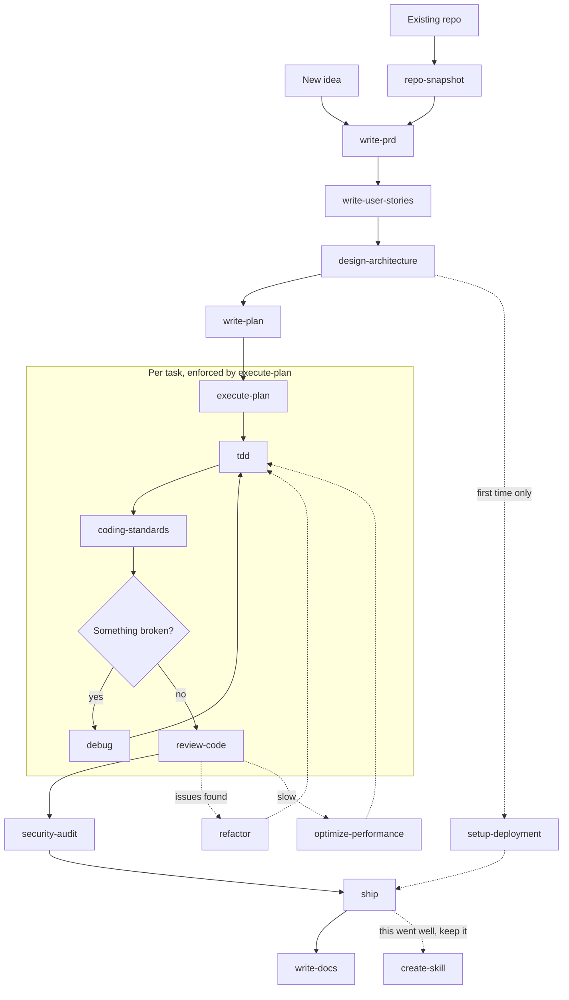

# Architecture

| | |
| --- | --- |
| Extended by | [`architecture/tiered-multi-harness-support.md`](architecture/tiered-multi-harness-support.md), ADR-0003, ADR-0004, ADR-0005 |

**Layer 1 below describes Claude Code.** Which gates a harness actually delivers is stated in one
generated place, `docs/harness-support.md`, and nowhere else. Do not add a sentence
here saying which harnesses have a gate; `tests/test-harness-claims.sh` will fail it.

## The core idea

Three layers, each with a different lifetime and a different token cost.

```text
Layer 3  SKILLS          25 skill bodies, loaded on demand, ~690 words each
         (in the plugin)  Cost: ~40 tokens each for the description line, body only when invoked

Layer 2  PROJECT CONFIG  .keel/profile.json + a CLAUDE.md block + docs/keel/
         (in the repo)    Cost: ~450 tokens, always in context, stable across sessions

Layer 1  HARNESS GATES   hooks registered with the harness
         (in the repo)    Cost: near zero in context, enforced by the runtime not the model
```

Layer 1 is the layer that varies by harness. On Claude Code it is four gates in
`.claude/settings.json`. On another harness it is whatever that harness's primitives support, which
is not the same set, and a gate keel cannot deliver there is not registered there. See
`docs/harness-support.md` for what each harness actually gets.

The split matters. Anything the model can rationalise its way out of belongs in Layer 1.
Anything every session needs belongs in Layer 2 and must stay small and byte-stable so
the prompt cache holds. Everything else is Layer 3 and costs nothing until used.

## Why a plugin and not vendored files

The obvious approach is a script that copies skills into each project's `.claude/skills/`.
It is wrong for a company with many repos:

- Every repo pins a snapshot. Six months on you have six versions of `tdd` in the wild.
- Improvements need a PR per repo.
- The skills show up in code review diffs and in `git blame` noise.

Instead: skills live once in the plugin, installed per machine. The repo carries only the
project's own facts (its stack, its verify commands, its gates). Upgrading keel
upgrades every project at once. This is the single most important structural decision and
it is what gstack got right.

The trade-off: a repo alone does not carry the SOP, so a teammate without the plugin gets
a normal Claude Code session. `keel init` handles this by writing a marketplace reference
plus a `SessionStart` hook that tells an uninstalled session how to install. `--team` stages
both for commit, so they reach the clone instead of sitting untracked in one developer's
working copy.

## The workflow



Solid arrows are the default path. Dotted arrows fire conditionally. Each skill writes a
file the next skill reads, so context does not have to survive across sessions in the
conversation, only on disk.

## Artifact chain

Every skill's output is the next skill's input. This is what makes the pipeline resumable
after a `/clear` and what keeps token use flat as a project grows.

| Skill | Reads | Writes |
| ------- | ------- | -------- |
| `repo-snapshot` | the codebase | `<docs_root>/snapshot.md` |
| `write-prd` | snapshot, or a conversation | `<docs_root>/prd/<slug>.md` |
| `write-user-stories` | PRD | `<docs_root>/stories/<slug>.md` |
| `design-architecture` | PRD, stories, snapshot | `<docs_root>/architecture/<slug>.md`, `<docs_root>/decisions/ADR-NNNN-*.md` |
| `write-plan` | architecture, stories | `<docs_root>/plans/YYYY-MM-DD-<slug>.md` |
| `execute-plan` | plan | code, commits, checked boxes in the plan |
| `coding-standards` | the codebase, or an existing `standards.md` | `<docs_root>/standards.md`, or `<docs_root>/audits/YYYY-MM-DD-standards.md` in assess mode, or `<docs_root>/audits/YYYY-MM-DD-standards-audit.md` in audit mode |
| `security-audit` | diff or whole repo | `<docs_root>/audits/YYYY-MM-DD-security.md` |
| `incident-response` | the running system, runbooks | `<docs_root>/incidents/YYYY-MM-DD-<slug>.md` |
| `setup-deployment` | profile, architecture | `.github/workflows/*`, `Dockerfile`, `<docs_root>/runbooks/deploy.md` |
| `write-docs` | everything above | `README.md`, `<docs_root>/runbooks/*`, process-flow diagrams |
| `create-skill` | the session transcript | a new skill in the keel repo, as a PR |

### The docs root is a variable, not a path

Every path above is written `<docs_root>` because it resolves from `profile.docs_root`, whose
default is `docs/keel`. Three notations, one per audience, and mixing them is the mistake:

| Where | Notation | Resolved by |
| --- | --- | --- |
| Skills and this documentation | `<docs_root>/prd/<slug>.md` | The model, reading `profile.docs_root` at invocation |
| Templates that `keel init` renders | `{{DOCS_ROOT}}/prd/<slug>.md` | `keel init`, by substitution |
| `profile.docs_root` itself, and prose naming the default | `docs/keel` | Nothing. It is the literal value |

**No skill, and no template, may contain a literal `docs/keel`.** A project that sets a
different root would get a skill writing to a directory nobody reads, or a rendered CLAUDE.md
block pointing every session at files that do not exist. Both fail silently, which is what
makes the rule worth enforcing mechanically rather than by review: `keel doctor` and
`tests/validate-skills.sh` both fail on a literal.

The default itself is `docs/keel` and prose is free to say so, as the next paragraph does.

The docs root is committed. It is the project's memory and it is readable by humans, which
is the point: a PRD nobody can find is not a PRD.

## The profile: one file, no guessing

`.keel/profile.json` is the contract between the repo and every skill. Without it, each
skill burns tokens rediscovering how to run tests, and each one guesses differently.

```json
{
  "stack": { "language": "typescript", "runtime": "node20", "framework": "nestjs" },
  "verify": {
    "test": "npm test",
    "test_one": "npm test -- {path}",
    "lint": "npm run lint",
    "typecheck": "npm run typecheck",
    "build": "npm run build",
    "e2e": "npm run test:e2e"
  },
  "gates": { "coding_standards": "required", "security_audit": "required", "done_verified": "required" },
  "deploy": { "target": "gcp-cloud-run", "envs": ["dev", "staging", "prod"] }
}
```

`keel init` generates this by detection and asks about what it cannot detect. `keel doctor`
verifies every command in `verify` actually runs.

## Which model runs a delegated brief

Several skills fan work out to subagents. Those briefs name a **delegation profile**, a name each
harness resolves to its own model, so the wide mechanical reading does not run on whatever the
session happens to be pinned to (ADR-0005):

| Brief | Delegation profile | Why |
| --- | --- | --- |
| `repo-snapshot`, `port-assess`, `apex-port-plan`, `shape-idea`, `write-docs`, `write-plan`, `security-audit` fan-outs | `keel-fanout` | Wide mechanical reading over many files, with a cited `path:line` for every claim, so the output is checkable |
| `execute-plan` implementation, both reviews and concurrent batches, and the `write-plan` reviewer | `inherit` | These write code under the TDD gate or judge another agent's verdict. A cheaper model gets less benefit of the doubt, not more |

Every dispatch announces its profile in the brief's own `description`, leading it:
`Agent(keel-fanout: <task>)`, `inherit` labelled the same way and never omitted. `docs/standards.md`
has the full rule, "A dispatch names its model, and says so". `tests/validate-skills.sh` rejects any
vendor model alias in a brief, and fails a dispatch that names no routing at all, because a brief
sent to a model that does not exist is a brief sent to nothing and the failure is silent.

**A session's own model is not part of this and cannot be.** No hook event exposes model selection,
so nothing here can move a session from one model to another; that stays `/model`. There is no
complexity router either: routing pays on work that is long and mechanical, not on work that is
simple, so a router keyed on guessed complexity is wrong in the direction nobody notices. The
reasoning is in [`docs/ideas/model-routing.md`](ideas/model-routing.md).

## Enforcement: hooks, not pleading

Skills are instructions and a model under pressure negotiates with instructions. superpowers
answers this with rationalisation tables and all-caps prohibitions, which works, partly. The
harness answers it better. Where a rule is genuinely non-negotiable, we put it in a hook, on the
harnesses whose hook protocol can carry it. The mechanisms below are Claude Code's, and the last
column says which harnesses actually carry each rule. `docs/harness-support.md` is generated from
the capability manifest and is the authority; this column is prose and can go stale, which is why
it names harnesses rather than restating what each gate does.

| Rule | Mechanism | Why | Carried on |
| ------ | ----------- | ----- | ------------ |
| Session knows keel exists | `SessionStart` hook injecting the router pointer | Model cannot skip what it never sees | Claude Code and Codex |
| Edits get a security pattern check | `security-guidance` plugin `PostToolUse` hook | Runs on every edit, no invocation needed | Claude Code only, it is a Claude Code plugin |
| Diff gets an LLM security review before the turn ends | `security-guidance` plugin `Stop` hook | An automatic audit before code ships, not one somebody has to remember to ask for | Claude Code only, same reason |
| Format, lint and typecheck pass before a commit | optional `keel guard` `pre-commit` git hook, off until `gates.commit_guard` turns it on | See open decision 4, it can be slow | Either, it is a git hook and not a harness one |

Everything else stays in skills, where judgement belongs.

## Skill anatomy

Every skill in keel follows the same shape. This is enforced by `keel doctor`.

```markdown
---
name: write-prd
description: Use when the user has a product idea, an existing feature to specify, or
  asks for requirements, a spec, or a PRD, before any design or implementation work.
allowed-tools: [Read, Write, Grep, Glob, AskUserQuestion, Agent]
---

# Write PRD

## Overview          <- what and the core principle, 2 sentences
## When to use       <- symptoms and triggers, plus when NOT to
## Inputs            <- which artifacts it reads, which profile keys it needs
## The process       <- numbered steps, each with a verify line
## Output contract   <- the exact file path and section list it must produce
## Common mistakes   <- what goes wrong
```

Hard rules, from superpowers' skill-authoring guidance and validated by their testing:

- `description` states **when to use**, never **what it does**. A description that
  summarises the workflow becomes a shortcut the model takes instead of reading the body.
- Body targets 700 words, ceiling 900 (ADR-0001). Heavy reference goes in a sibling file, linked
  by relative path.
- Never use `@file` links. They force-load and burn context before it is needed.
- Cross-reference other skills by name with an explicit marker: `**REQUIRED SUB-SKILL:** keel:tdd`.

## What we deliberately leave out

- **A browser daemon.** gstack's largest component. Use the `playwright` plugin where a
  project needs browser QA.
- **Telemetry.** gstack logs every skill invocation. Useful for them, noise for us, and it
  writes to disk on every run.
- **Our own model-routing or preamble-generation engine.** gstack generates SKILL.md files
  from templates through a TypeScript build. That is real complexity to maintain. Our
  skills are hand-written markdown. If we later need shared preamble text, a `references/`
  file linked from several skills covers it at a fraction of the cost.
- **A design system.** cursor-starter ships one. Out of scope; the `frontend-design`
  plugin covers this better.
