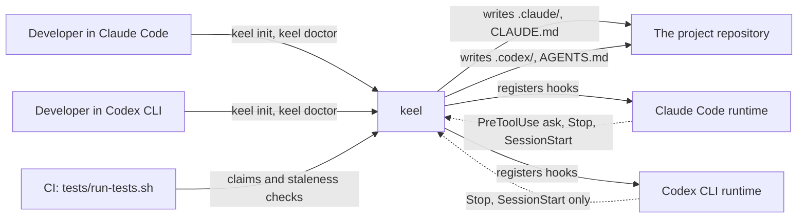
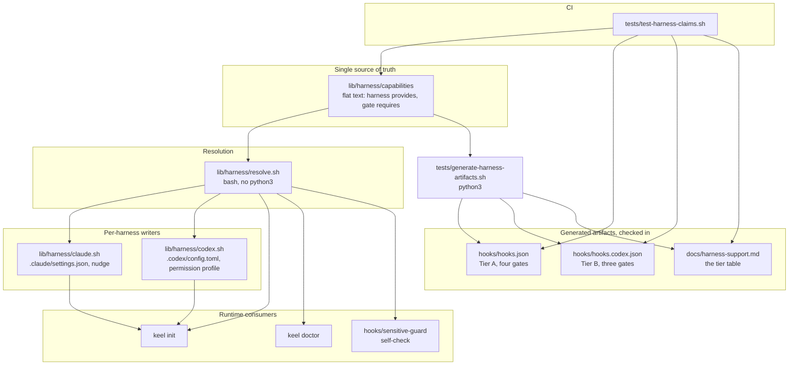
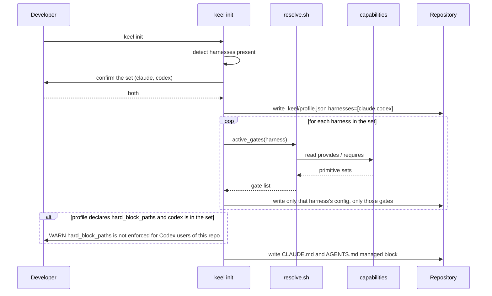
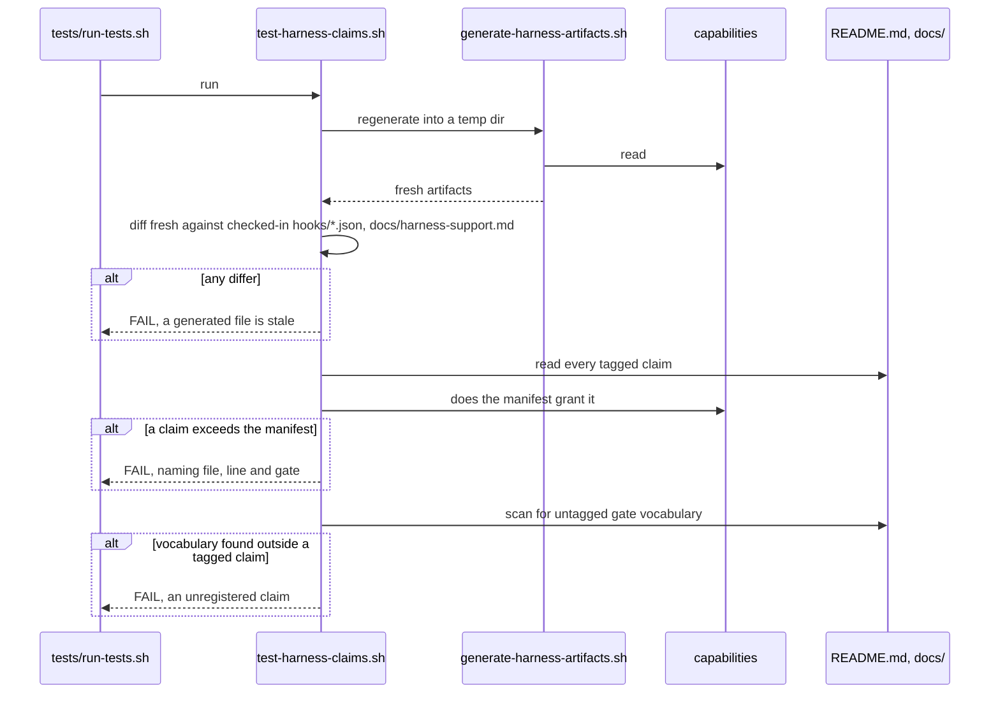

# Architecture: tiered multi-harness support

| | |
|---|---|
| Status | accepted 2026-09-05 |
| Mode | existing |
| Date | 2026-09-05 |
| Requirements | No PRD. Driver is [`docs/ideas/keel-on-codex.md`](../ideas/keel-on-codex.md), amended 2026-09-05 |
| Stories | None yet |
| Extends | [`docs/01-architecture.md`](../01-architecture.md) |
| ADRs | ADR-0003, ADR-0004, ADR-0005, all accepted 2026-09-05 |

## 1. Summary

keel gains a second supported harness, OpenAI Codex CLI, at a lower tier than Claude Code. The
shape chosen is a **capability manifest with one generator and four consumers**: a checked-in data
file states which primitives each harness provides and which primitives each gate requires, and
everything downstream (the hook manifests, `keel init`'s writes, `keel doctor`'s report, and the
tier table in README) is derived from it rather than written by hand. What that shape optimises for
is a single property: **no gate is registered, written into a repository, or advertised in a
document on a harness that cannot run it, because the manifest is the only thing any of those three
paths consult.**

That property is exact, and deliberately narrower than "a gate cannot exist there". The plugin's own
files are distributed by cloning one repository, so `hooks/sensitive-guard` is present on a Codex
machine whatever the manifest says. What stops that misleading anyone is behavioural rather than
structural: the hook exits 2, which blocks the command and explains why, and that in turn depends on
keel's hooks loading synchronously. Section 7 traces why they do, what pins it, and the one upstream
change that would break it; section 12 carries the decision. **Nothing in this document claims the
file is absent, and nothing claims the guarantee is unconditional.**

## 2. Forces

| Force | Source | Weight |
|---|---|---|
| A gate that looks installed and is not is worse than no gate. Tiering relocates this risk into tier-claim drift rather than dissolving it | `docs/ideas/keel-on-codex.md` Part 4 and its 2026-09-05 amendment | **Dominant** |
| Tier A must not regress. Claude Code behaviour is unchanged, byte for byte where possible | Requester, Tier A definition | Fixed, not negotiable |
| Codex cannot express a scoped human approval prompt. `permissionDecision: "ask"` is schema-valid and discarded, and the tool call proceeds | `keel-on-codex.md` Part 1 test 3; `openai/codex#28437`, open since 2026-06-16 | Fixed, external |
| Tier claims must be mechanically checked. Prose that outruns the code is a test failure, not a documentation nit | Requester, stated non-negotiable | High |
| Skill bodies sit against a hard 900-word ceiling with single-digit headroom on the tightest | ADR-0001; `tests/validate-skills.sh` | High, and it binds the skills decision alone |
| `bin/keel` is 2,020 lines of bash with 76 coupling points, but they sit in 3 of 7 subcommands and every writer is a leaf | Brief F, `bin/keel#init)        shift; cmd_init "$@" ;;` dispatch | Medium |
| Per-release eval cost doubles, 6 runs to 12, roughly $6 | `keel-on-codex.md` Part 4 | Medium, accepted by the requester |
| No new runtime dependency. keel is bash plus an optional python3 | `bin/keel:59-61`, `.keel/profile.json` `stack` | Medium |

**The dominant force names itself.** Every structural choice below is answerable to one question:
after this change, can a person believe they have a gate they do not have? Where the answer is
"only if someone forgets", the design is wrong, because that is precisely the failure the original
record declined the whole harness to avoid.

## 3. Approaches considered

### A. Inline branches at each coupling point

Each of the 76 Claude-coupled lines in `bin/keel` gains a conditional on the active harness, and
`hooks/hooks.json` gains a second copy edited by hand. Nothing else changes.

**Cost.** The smallest diff, no new files, no new concepts. **Forecloses** nothing structurally.
**Wrong when** the thing you must prevent is a claim drifting away from the code, because a branch
is exactly as easy to add wrongly as rightly: nothing stops the next person writing a branch that
registers `sensitive-guard` on Codex, and nothing would fail if they did.

### B. Strategy files with a fixed function contract

`lib/harness/claude.sh` and `lib/harness/codex.sh`, each defining the same seven functions
(`harness_config_paths`, `harness_write_config`, `harness_permission_rules`, and so on). `bin/keel`
sources one per enabled harness and calls only through the contract. The neutral 70% never names a
harness.

**Cost.** Moves roughly 300 lines and introduces a contract that must be kept in step across two
files. **Forecloses** little. **Wrong when** the contract is the only thing standing between a
person and an inert gate, which it is: a contract is a convention, and `harness_write_config` in
`codex.sh` can write whatever its author types.

### C. Capability manifest, with the strategy files inside it (chosen, 2026-09-05)

One checked-in data file states what each harness provides and what each gate requires. A gate is
active on a harness if and only if the harness provides every primitive the gate requires. Four
things are then **derived** from that file rather than written: the per-harness hook manifests, what
`keel init` writes into a repo, what `keel doctor` reports, and the tier table in `README.md`. Two
tests fail the build when a derived artifact is stale, or when a document claims a gate the manifest
does not grant. The strategy files from B still exist, but they may only act on the gate set the
manifest yields.

**Cost.** The highest: a generator, two new test files, a regeneration step in the release routine,
and one new concept for a reader to learn. **Forecloses** ad-hoc per-harness special-casing, which
is the point rather than a side effect. **Wrong when** there will only ever be two harnesses
differing by one gate, in which case the generator costs more than the drift it prevents.

### Why C wins, and the honest caveat

C wins on the dominant force alone. A and B both leave the tier claim as a convention maintained by
whoever edits the installer next, and the requester's stated non-negotiable is that the claim be
mechanically true. Only C makes the README table a derived artifact and the absent gate a
consequence of data rather than a thing someone remembered.

**The caveat, stated plainly because it is the strongest argument against this design:** the current
difference between the two harnesses is one gate. C is more machinery than one gate justifies on its
own merits, and if the requirement were only "support Codex", B would be the correct and much
cheaper answer. C is justified by the requirement that the claim be checked, not by the size of the
difference. If that requirement is relaxed, this design should be reduced to B rather than trimmed.

This repository already generates one document and fails the build when it goes stale
(`tests/generate-profile-keys.sh:1-6`: "Generated, a stale page is a failing build rather than a
wrong sentence", enforced by `tests/test-profile-keys.sh`). C applies an established local pattern
to a second document rather than importing a new idea.

## 4. Structure

### The stack

Unchanged, deliberately. **bash** for `bin/keel`, `lib/*.sh` and every hook, the same POSIX-oriented
dialect already in the tree. **python3** stays an optional dependency used for JSON work
(`bin/keel:59-61`), available to generators and to `keel init`, but **not** to the hook path.
**Markdown** for skills and docs. **No new runtime dependency, and no new language.**

One consequence drives a format choice. The capability manifest is read by `hooks/sensitive-guard`,
which must behave correctly on a machine with no python3, so the manifest is a **flat
pipe-delimited text file** read by bash builtins rather than JSON. It carries two harnesses and
about ten primitives; JSON would buy nothing here and would put the gate's correctness behind an
optional interpreter. Everything downstream of the manifest that is not a hook may use python3
freely.

### Context



The dotted arrows carry the whole design. Claude Code calls back on four events; Codex calls back on
three. Everything else follows from that asymmetry being written down once.

### Container



### Components

| Component | Responsibility | Satisfies | Depends on |
|---|---|---|---|
| `lib/harness/capabilities` | State which primitives each harness provides and which each gate requires. The only place either fact is written | The mechanical-truth requirement | Nothing |
| `lib/harness/resolve.sh` | Answer "is gate G active on harness H", in pure bash. The only function permitted to answer it | Tier A no-regression; the non-negotiable | `capabilities` |
| `lib/harness/claude.sh` | Tier A writers, moved verbatim from `bin/keel`: `.claude/settings.json`, `.claude/settings.local.json`, `write_nudge`, plugin recommendations | Tier A no-regression | `resolve.sh` |
| `lib/harness/codex.sh` | Tier B writers: Codex permission profile, `.codex/agents/*.toml` for the delegation model pin | Tier B definition | `resolve.sh` |
| `tests/generate-harness-artifacts.sh` | Emit `hooks/hooks.json`, `hooks/hooks.codex.json` and `docs/harness-support.md` from the manifest | The mechanical-truth requirement | `capabilities` |
| `tests/test-harness-claims.sh` | Fail the build when a generated artifact is stale, or a doc claims a gate the manifest does not grant | The mechanical-truth requirement | all of the above |
| `keel doctor` harness section | Report the harness actually running and the gate set actually active in this repo under it | The non-negotiable | `resolve.sh` |
| `hooks/sensitive-guard` self-check | Exit 2 with the reason on stderr, blocking rather than reporting, when the running harness does not provide `pretooluse_ask` | The dominant force | `resolve.sh` |
| `.codex-plugin/plugin.json` | Declare `"skills": "./skills/"` and `"hooks": "./hooks/hooks.codex.json"` | Tier B distribution; the zero-drift skills requirement | `hooks.codex.json` |

### The manifest, concretely

```
# harness | primitive
claude | session_context_injection
claude | stop_blocking
claude | pretooluse_deny
claude | pretooluse_ask
claude | transcript_path
claude | permission_rules_command_patterns
claude | permission_rules_path_globs
claude | plugin_marketplace
claude | output_styles
codex  | session_context_injection
codex  | stop_blocking
codex  | pretooluse_deny
codex  | transcript_path
codex  | permission_rules_path_globs
codex  | plugin_marketplace
codex  | execpolicy_command_prompt

# gate | requires
session-start   | session_context_injection
done-guard      | stop_blocking
done-guard      | transcript_turn_tool_calls
context-watch   | transcript_turn_usage
sensitive-guard | pretooluse_ask
```

**A gate may require more than one primitive, and `done-guard` does.** Blocking a stop and reading
what the turn did are separate capabilities, and Codex provides the first without the second.
Sketching this with a single `transcript_path` primitive resolved `done-guard` **active on Codex**
on the strength of `stop_blocking` alone, where it would have read a Codex transcript looking for
Claude Code's JSONL rows and failed open in silence. Caught in review on 2026-09-05. It is the same
defect this design exists to prevent, and it had reached the design itself: `transcript_path` now
names only the promise of a path, and per-turn usage and the turn's tool calls are named separately.
**Those two name capabilities, not Claude Code's file format**, and the harness-specific shape lives
in the `<source>` evidence instead. Named after the wire format, as they briefly were, no second
harness could ever hold either row however much evidence it had, which is a permanent failure rather
than a fail-closed one.

`sensitive-guard` requires `pretooluse_ask`. `codex` does not provide it. Therefore
`hooks/hooks.codex.json` contains no entry for it, `keel init` writes no registration for it under
Codex, `keel doctor` reports it absent, and `docs/harness-support.md` says so. **Not because four
places agree, but because there is one place and the other four are generated from it.**

## 5. Data

There is no datastore. The "data" is config files in a repository, and the question that matters is
who owns each one and what happens when two harnesses want the same repository.

| File | Owner | Written when | Harness | On a dual-harness repo |
|---|---|---|---|---|
| `.keel/profile.json` | keel, merged with the project's values | `init`, `profile set` | Neither, shared | One file. Gains `harnesses: ["claude","codex"]`, bumping `schema_version` to 3 |
| `CLAUDE.md` managed block | keel, between markers | `init` | Claude | Written. Already dual-written today (`bin/keel:927-928`) |
| `AGENTS.md` managed block | keel, between markers | `init` | Codex | Written. Same block, merged against its own file |
| `.claude/settings.json` | keel writes, team commits | `init` | Claude | Written only when `claude` is in the set |
| `.claude/settings.local.json` | per developer, git-ignored | `init` | Claude | Same |
| `.codex/config.toml` permission profile | keel writes, team commits | `init` | Codex | Written only when `codex` is in the set |
| `.codex/agents/*.toml` | keel | `init` | Codex | Carries the delegation model pin the skill bodies no longer name |
| `hooks/hooks.json`, `hooks/hooks.codex.json` | generated from the manifest | release | Both | In the plugin, not the repo. Never hand-edited |

**`schema_version` is the migration mechanism and it already exists.** `bin/keel:1584-1606` warns
when a repository's profile is older or newer than the installed keel, with wording that already
handles the mixed-team case. Adding `harnesses` bumps `SCHEMA_VERSION` from 2 to 3 and reuses that
path rather than inventing one.

**The derived-versus-stored question.** The active gate set is **derived**, always, from the
manifest plus the harness. It is never stored in the profile, never cached, and never written into a
repository as a fact. Storing it would create exactly the drift this design exists to prevent: a
repository carrying a stale copy of a claim that the plugin has since changed.

## 6. Critical paths

### 6.1 `keel init` on a repository serving both harnesses



**The `alt` branch is the load-bearing part of this diagram.** A repository declaring
`hard_block_paths` while serving Codex has declared a protection that half its team does not have.
That must be said out loud at the moment it becomes true, not discovered later.

**Failure branches.** If harness detection is ambiguous, `init` asks rather than guessing, and
`--harness` overrides both. If the manifest is missing or unreadable, `init` **aborts**: it does not
fall back to a built-in default set, because a default set is a claim nobody checked.

### 6.2 The claims check in CI



**Two-sided on purpose.** A registry alone catches wrong claims and misses new ones; a vocabulary
scan alone is a regex over prose, which this repository has explicitly rejected as a technique
(`tests/test-doc-claims.sh:1-16`, "a check that half-works on prose is worse than a short list
somebody has to extend deliberately"). Together the registry gives precision and the scan gives
coverage: the scan's only job is to fail when a gate word appears in a sentence nobody registered,
which is a coarse question a regex can answer honestly.

Claims are tagged in place, next to the sentence they qualify:

```markdown
<!-- keel:claim gate=sensitive-guard harness=claude -->
`keel init` writes `ask` rules that survive `bypassPermissions`.
```

## 7. Failure modes

| Failure | Detection | Behaviour | Open or closed | Recovery |
|---|---|---|---|---|
| A document claims a gate the target harness does not deliver | `test-harness-claims.sh` registry check, every PR (CI runs `tests/run-tests.sh` on push and PR) | Build fails, naming file, line and gate | **Closed** | Fix the sentence, or fix the manifest if the sentence was right |
| A new harness-dependent sentence is written with no claim tag | Vocabulary scan in the same test | Build fails as an unregistered claim | **Closed** | Tag it, which forces the author to name a harness |
| A generated hook manifest or the tier table is hand-edited | Regenerate into a temp dir and diff | Build fails as stale | **Closed** | Re-run the generator |
| `keel init` run with a manifest missing or unreadable | Existence and parse check at entry | Abort, write nothing | **Closed** | Reinstall the plugin |
| A repository declares `hard_block_paths` and serves Codex | `init` at write time, `doctor` on every run | Warns, every time, naming the harness whose users are unprotected | **Open, deliberately** | Drop `codex` from the set, or accept and record it |
| `hooks/sensitive-guard` wired onto Codex by hand | Self-check on the harness's provided primitives at hook entry | Writes the reason to stderr and **exits 2**, which on Codex sets `should_block` and surfaces the message as the block reason | **Closed.** The command is stopped, not merely reported | Unwire it, or add `claude` to the set. See section 7's note for the one residual, `codex exec --json` |
| A generated hook manifest ships `"async": true`, or the field is dropped upstream from failing safe | `tests/test-harness-claims.sh` asserts `"async": false` on every control-bearing gate in the checked-in manifests, and the generator emits it | Build fails | **Closed** | Fix the generator. Note the serde default is already `false` (`hook_config.rs:172`), so this guards a regression, not the common case |
| Codex transcript format changes under `context-watch` | Recorded-fixture canary test, plus unknown-format detection at runtime | Watchdog reports itself inactive rather than reporting zero tokens | **Closed** | Refresh the parser and the fixture |
| The running harness cannot be identified | `resolve.sh` returns `unknown` | `doctor` reports it cannot determine the harness; every gate requiring a primitive is treated as absent | **Closed** | Pass `--harness`, or fix detection |
| python3 absent on the machine | Not applicable to the gate path | Manifest is flat text, `resolve.sh` is pure bash, gates unaffected | **Closed** | None needed |
| The manifest itself is wrong | See below | See below | **This is the deepest failure in the design** | See below |

### The two failures that cannot be closed, and what is done instead

**1. The plugin payload cannot be made harness-specific, so `hooks/sensitive-guard` lands on every
Codex machine. Decided 2026-09-05: accept, with the mitigation below and the risk note in section
12.** Two facts were established before deciding, both verified first-hand rather than taken from a
brief.

**Fact one: a plugin author cannot exclude a file from an install.** `--sparse` on
`codex plugin marketplace add` is `Vec<String>` parsed from the **installer's** command line
(`codex-rs/cli/src/marketplace_cmd.rs:76-80`), used to drive `git sparse-checkout set` after a
no-checkout clone (`codex-rs/core-plugins/src/marketplace_add/install.rs:28-42`). Nothing reads a
path set out of the cloned repository. The plugin manifest has no `exclude`, `files` or `ignore`
field (`codex-rs/plugin/src/manifest.rs:8-24`), and the only packaged-bundle path that exists is
reserved to OpenAI's own plugin-share backend and archives every file with no exclude logic. There
is no author-side mechanism, so **the distribution fix this design hoped for does not exist and
cannot be waited for.**

**Fact two, and it reverses the earlier conclusion: the mitigation can both block and explain.** An
earlier draft of this section said the command still runs and only loudness is available. That was
wrong in both directions. On `PreToolUse`, Codex discards a failed hook's stderr and shows the human
only `"hook exited with code 1"`, so an ordinary non-zero exit would have been **less** loud than
claimed. But **exit code 2 is a control code with its own path**, quoted verbatim from
`codex-rs/hooks/src/events/pre_tool_use.rs`:

```rust
Some(2) if handler.can_apply_control_effects() => {
    if let Some(reason) = common::trimmed_non_empty(&run_result.stderr) {
        status = HookRunStatus::Blocked;
        should_block = true;
        block_reason = Some(reason.clone());
```

So the design is: when `hooks/sensitive-guard` finds the running harness does not provide
`pretooluse_ask`, it writes its explanation to stderr and **exits 2**. On Codex that sets
`should_block = true` and surfaces the explanation as the block reason. A hand-wired
`sensitive-guard` on Codex does not silently pass commands. It blocks them, with a message naming
the misconfiguration, which is fail-closed and is a better outcome than the one this design was
built expecting.

**Fact three, added after review: the guard on that match arm had to be analysed, not just quoted.**
`Some(2) if handler.can_apply_control_effects()` is a conditional arm. When the guard is false,
exit 2 does not match it at all: it falls through to the generic arm, reports
`"hook exited with code 2"`, and the tool call proceeds. So the whole mitigation rests on that guard
being true for keel's hooks. It is, and the reason is specific rather than incidental:

`can_apply_control_effects()` is `execution_mode() == Sync` (`engine/mod.rs:154-156`), and
`execution_mode()` returns `Async` in exactly two cases (`:141-149`): any `ExecutorScoped` handler,
unconditionally, or a `Command` handler with `async: true`.

| Question | Answer | Evidence |
|---|---|---|
| Do plugin-delivered hooks load as `ExecutorScoped`? | **No. They load as `Local`.** | `ExecutorScoped` is constructed in exactly one place, `set_executor_hooks` (`engine/mod.rs:327`). Plugin hooks take `append_plugin_hook_sources` (`discovery.rs:243`), which injects `PLUGIN_ROOT`/`CLAUDE_PLUGIN_ROOT` and calls `append_hook_events`, which sets `source_path: source.path.clone().into()` (`discovery.rs:729`), and the `From<AbsolutePathBuf>` impl (`engine/mod.rs:91-95`) yields `Local` |
| Could keel's hooks ever take the `ExecutorScoped` path? | **Not as written.** | `set_executor_hooks` destructures the handler and `unreachable!("allowlisted executor handler must be an MCP tool")` on anything else, then builds `kind: ConfiguredHandlerKind::McpTool`. keel ships `type: "command"` hooks, which cannot reach it |
| What then pins the guard true? | The `async` flag alone | `execution_mode()` reduces to `Command { async }` for every keel hook |

**So the guarantee holds for the distribution case, and open question 1 stays closed on the guard
rather than on the arm.** Two things follow, and both are design obligations rather than
observations.

**`async: false` becomes a checked property, not a convention.** The flag fails safe: it is
`#[serde(default)] r#async: bool` (`codex-rs/config/src/hook_config.rs:172`), and Rust's `bool`
default is `false`, so omitting it yields `Sync`. keel's current `hooks/hooks.json` sets it
explicitly on all seven entries anyway. **No test asserts it**, and a silent flip of that one flag
turns every control-bearing gate advisory while leaving it installed, registered and reported as
present, which is this design's dominant failure exactly. The generator emits `"async": false` for
every control-bearing gate, and `tests/test-harness-claims.sh` asserts it in the checked-in
manifests. Because those manifests are also regenerated and diffed, a flip has to defeat two locks.

**The CCA TODO is a standing upstream risk, and it is wider than `sensitive-guard`.** The doc comment
on `ExecutorScoped` (`engine/mod.rs:76-81`) reads: executor-scoped handlers "are always executed
async", and "TODO: With CCA, all hooks will be executor-scoped, so user visibility ... and execution
behavior (non-blocking) will need to be determined independently." The property this design depends
on is scheduled to be re-decided upstream.

It is not confined to the exit-2 path. `can_apply_control_effects()` also gates the **stdout JSON
decision** path, at `pre_tool_use.rs:224,234` and at `stop.rs:295,326`. `hooks/done-guard` blocks by
emitting a JSON decision on `Stop`. So if CCA makes all hooks executor-scoped and therefore async,
**`done-guard` stops blocking too**, and Tier B loses a second of its three gates, silently, without
any keel change. That is on open question 1's trigger list and is the single most likely way this
design becomes wrong without anyone touching it.

**The residual, stated rather than rounded off.** In `codex exec --json`, hook events emit nothing at
all (`codex-rs/exec/src/event_processor_with_jsonl_output.rs:467-469`), so in a fully non-interactive
JSON run the block still happens and the explanation is not in the stream. The command is stopped,
which is the half that matters for safety; the diagnosis is missing, which costs the operator time.
That is the whole of the accepted risk.

**Where the non-negotiable now stands, precisely.** Met for registration, met for repository writes,
and met behaviourally for the payload, because the one file that could mislead refuses to run and
stops the command instead. **Not** met literally: the file is on disk and nothing keel can do removes
it. This is not a release blocker, because the failure mode the requirement exists to prevent, a
person believing they are protected when they are not, does not occur: the misconfiguration is
impossible to operate through.

**2. The manifest is itself a claim, and something has to check it.** A design whose correctness
rests on a data file saying "codex does not provide `pretooluse_ask`" has moved the trust rather
than removed it, which is the same criticism this design levels at prose. The answer is that every
manifest row carries provenance and is checked against a recorded observation:

- Rows verifiable from a vendor artifact (a published schema, an enum in released source) are
  pinned to a checked-in fixture recording the artifact, its URL, and the date read. A test asserts
  the manifest matches the fixture.
- Rows verifiable only by running the harness (does a `deny` survive `approval_policy = "never"`)
  are recorded in `docs/harness-support.md` as a probe result carrying the date and the **harness
  version string it was observed against**, such as `rust-v0.153.4`.

**Freshness itself is not mechanically checkable here, and the design does not pretend it is.** An
earlier draft said a test fails when a probe is "older than the current release train". That is not
a computable boundary: the test suite has no network, and a date-based expiry would make the build
fail by calendar rather than by change, which this repository has explicitly rejected as a technique
(`tests/generate-profile-keys.sh:11`, "Deterministic by construction: no date, no path, no counter,
nothing from the environment"). What is computable, and what the test actually enforces, is
**completeness of provenance**: every manifest row has a source, a version and a date, no row is
missing one, and every probe row appears in `docs/harness-support.md`. Freshness moves to two places
where a human is already looking: a step in the release routine, and `keel doctor`, which prints the
version each probe was taken against beside the version of the harness it is currently running.
- A primitive with no probe and no fixture is treated as **not provided**. Absent evidence is a
  fail, never a pass.

The residual, said once and not softened: **the guarantee is "as of the recorded date"**. keel does
not interrogate the vendor at runtime and cannot. That is the same class of guarantee the current
Claude Code gate has (`bin/keel:558` records a live-session verification from a date, not a
continuous check), so this is not a new weakness, but it is now load-bearing for two harnesses
instead of one and the probe dates must be kept fresh.

## 8. Security architecture

The trust boundary that changes is the one between *a person's belief about a repository* and *what
that repository actually enforces*. Before this change, that boundary was crossed once, at install,
and the answer was the same for everyone. After it, the answer is a function of
`(repository, harness)`, and there is no single sentence about a repository that is true for
everyone working in it.

Everything follows from refusing to let that fact be implicit:

- `keel doctor` answers for **the harness it is running under**, from the machine in front of the
  person, and separately names the other harnesses the repository serves and what they do not get.
- `hard_block_paths` gains a documented meaning it did not need before: it is enforced only on
  harnesses providing `pretooluse_ask`, and declaring it while serving a harness without that
  primitive is a standing warning, not a one-time notice.
- The permission rules keel writes are not portable and must not be presented as though they were.
  Codex has no command-pattern rule syntax; its permission profiles are path globs and network
  domains. So of the current 26 rules, the 5 `Read(./.env)`-shaped denies port to path globs and get
  *stronger*, the 8 `Bash(cat *.env*)` denies become redundant under them, and **all 13 `ask` rules
  have no counterpart at all.** Tier B's permission story is "deny is stronger, ask does not exist",
  and that sentence belongs in the tier table rather than in a footnote.

This is the design-time view. `security-audit` checks against it; it does not replace one.

## 9. Operations

**Release.** The generator runs as part of the release routine, and CI fails if its output differs
from what is checked in, so a release cannot ship a tier table that disagrees with the manifest.
Nothing here is generated at install time on a user's machine.

**CI.** `tests/test-harness-claims.sh` is added to `tests/run-tests.sh` with one `add` line
(`tests/run-tests.sh:18-37`; the runner hardcodes its file list rather than globbing, so this is a
deliberate one-line registration). It then runs on every push and pull request via
`.github/workflows/ci.yml`, alongside the existing suite. It needs no network and no harness
installed: it compares files against files.

**Evals.** Per-harness arms double the release gate from 6 dispatches to 12. This is a manual
per-release cost, not a per-PR one; evals are not in CI. Codex baselines must be *observed* rather
than inherited, which is one-time work of 6 to 12 additional dispatches, and ADR-0001's word ceiling
was calibrated against Claude Code's skimming behaviour and is **inherited but unvalidated** on
Codex until arms are run. That status is itself a claim, and it is registered as one so the build
fails if a document states the ceiling as validated on both harnesses.

**Observability.** None added. keel writes no telemetry by design
(`docs/01-architecture.md`, "What we deliberately leave out").

**Runbook.** `docs/harness-support.md` is the operational page: the generated tier table, the probe
dates, and the one paragraph stating what Tier B cannot claim.

**Required release note for the first Tier B release**, to be pasted into the CHANGELOG entry
verbatim rather than paraphrased or replaced by a link. `docs/runbooks/cutting-a-release.md` section
4 carries the obligation so it cannot be lost between this document and a release:

> **Codex support depends on an upstream behaviour that OpenAI has said it will revisit.** keel's
> gates block on Codex only because its hooks run synchronously. Codex's own source carries a TODO
> stating that with CCA all hooks become executor-scoped and therefore asynchronous, and asynchronous
> hooks cannot apply control effects. If that lands, **two of the three gates keel installs on Codex
> stop blocking**: `sensitive-guard` no longer stops a command, and `done-guard` no longer holds a
> turn open. Both remain installed, registered and reported as present, and **nothing in keel will
> fail or warn when it happens**, because the change is upstream and silent. Until this is resolved,
> treat Codex gate enforcement as something to re-verify on each Codex upgrade rather than as
> settled. Claude Code is unaffected.

The reason this is a release note rather than a design detail: it is the only risk in Tier B a keel
user cannot detect for themselves, from either the tier table or `keel doctor`, because at the moment
it becomes true both still say the gates are active.

## 10. Mechanism decisions

### 10.1 How `keel init` learns its target: both, and it is a set

**Deterministic detection from committed repository signals, an explicit flag to override, no
prompt, and the answer is a set rather than a switch.** `profile.harnesses` is an array.

The no-prompt part is a constraint rather than a preference: **`keel init` is non-interactive
today.** `bin/keel:806-807` records that `-y` "is accepted and has no effect", kept so scripts keep
working. Adding a confirmation would make this design the first thing to prompt in `init`, breaking
every scripted caller including `tests/generate-profile-keys.sh`, which runs `keel init -y` in a
fixture. R-01 forbids that. Detection is therefore decided from the tree, not from a person.

Resolution order, first match wins:

| # | Signal | Yields |
|---|---|---|
| 1 | `--harness claude`, `--harness codex`, `--harness claude,codex` | exactly that, authoritative |
| 2 | `.keel/profile.json` already carries `harnesses` | kept unchanged, the same merge behaviour `write_profile` already applies to project-owned values (`bin/keel:350-352`) |
| 3 | `.claude/settings.json` tracked in git | adds `claude` |
| 4 | `.codex/config.toml` tracked in git | adds `codex` |
| 5 | nothing matched | `["claude"]` |

**Tracked, not merely present**, because the set is a team fact that belongs in a commit. An
untracked `.codex/` is one developer's local state and must not silently change what the repository
claims for everybody.

**`AGENTS.md` is deliberately not a signal, and this is the trap worth naming.** keel has dual
written it since long before Codex was supported (`bin/keel:927-928`), so every existing keel
repository has one; Cursor, Copilot CLI and Gemini CLI read it too. Treating it as evidence of Codex
would mark the entire installed base as Codex-serving in a single upgrade, and would then warn every
one of them that their `hard_block_paths` is unenforced. It is the single most available signal and
the single most wrong one.

**Machine-level signals are not used by `init` at all.** Whether `codex` is on this developer's PATH
says nothing about what the repository should commit. They are used by `keel doctor`, which is the
right place for a machine-specific observation: it warns when you have a harness installed that this
repository does not list.

**What an existing `schema_version: 2` repository upgrades to: `["claude"]`, by rule 5.** A schema 2
profile was written by a keel that supported one harness, so Claude Code is the only harness it can
have been configured for. Nothing is inferred, nothing is prompted, and no existing repository
changes behaviour on upgrade. That is the same answer rule 5 gives a fresh repository, which is why
there is no migration step: the default and the upgrade path are one rule.

It must be a set because the case that decides it is real: a team where some people use Claude Code
and some use Codex, on one repository. A switch would make that repository's configuration a running
argument between two developers' last `init`. The precedent is already in the tree, since `keel
init` dual-writes `CLAUDE.md` and `AGENTS.md` today (`bin/keel:927-928`) for exactly this reason.

The consequence is the hard part, and it is carried in 6.1, 7 and 8: **a guarantee is a property of
`(repository, harness)`, never of a repository alone.** Every place keel currently states a
repository-level fact about enforcement has to become harness-qualified or point at
`docs/harness-support.md`.

### 10.2 How 25 skills reach Codex without drifting: they are not copied

**Plugin-bundled, pointing at the same directory. Nothing is copied, symlinked or synchronised.**

Verified first-hand against the vendor documentation on 2026-09-05
(`developers.openai.com/plugins/build/plugins.md`, 308-redirecting to `learn.chatgpt.com/docs/`):
a Codex plugin manifest at `.codex-plugin/plugin.json` declares `"skills": "./skills/"` and
`"hooks": "./hooks/hooks.json"`, with the rule "Keep manifest paths relative to the plugin root and
start them with `./`". Both values are author-chosen relative paths.

So `.codex-plugin/plugin.json` points `skills` at the **same `skills/` directory** the Claude Code
plugin already uses. There is one copy of every skill, in one place, and drift is not prevented by a
check but by there being nothing to drift from. `keel init` does not place skills on either harness.

The same fact settles the gate question structurally: `hooks` is an author-chosen path, so the Codex
manifest points at `hooks/hooks.codex.json`, a generated file that contains no `sensitive-guard`
entry. Claude Code discovers `hooks/hooks.json` by convention and never sees the Codex one.

**Probed 2026-09-06 on codex-cli 0.153.4, and two details tasks 10 and 11 would otherwise have got
wrong.** First, **the marketplace manifest Codex reads is `.claude-plugin/marketplace.json`**, not a
`.codex-plugin` one: `codex plugin marketplace add` refuses a root holding only the latter, with
"marketplace root does not contain a supported manifest". keel's existing
`.claude-plugin/marketplace.json` is therefore already the file Codex reads, and nothing new is
needed for discovery. Second, **hooks reach Codex only through a plugin.** A project-level
`<cwd>/.codex/hooks.json` was tried first and never fired; what fires is
`<plugin>/.codex-plugin/plugin.json` declaring `"hooks": "./hooks/hooks.json"`, exactly as the
vendor documentation above says. So there is no plugin-free way to install the gates, and the
unsupported recipe below is skills only.

For people who want the skills without installing a plugin, a documented, explicitly unsupported
`cp -R skills/. .agents/skills/` recipe belongs in `docs/harness-support.md`, carrying no guarantee.
That was left open by the idea record and this design takes it: it is honest, it costs a paragraph,
and it makes no claim the checks would have to police.

### 10.3 `lib/context_watch.py` on a Codex transcript: one interface, two parsers, and a canary

**Two parsers behind one interface, selected by sniffing the transcript's own shape rather than by
harness identity.** Selecting on shape rather than on harness costs nothing extra and catches the
case that actually bites: a format changing *within* one harness.

The maintenance cost is real and should not be dressed down. Codex states that the transcript
"isn't a stable interface for hooks and may change over time". Two implementations is the honest
accounting of that, and pretending one adapter absorbs it would be worse.

What makes it shippable inside the dominant force is the failure behaviour, not the parser count:

- An unrecognised transcript format returns `unsupported`, never zero. Reporting zero tokens is the
  silent-gate failure in miniature: a watchdog that has stopped working looks exactly like a session
  that is using no context.
- `unsupported` is surfaced in `keel doctor`, which is where the person is already looking.
  **Not in the hook's output, and that correction is from building it on 2026-09-06.** This said
  "surfaced twice, in the hook's output and in `keel doctor`". `hooks/context-watch` ends in
  `2>/dev/null` on purpose, so that a hook which breaks cannot put an error on the end of every turn
  in the session, and `lib/context_watch.py`'s message dies there. Making the hook speak would mean
  either lifting that guard or emitting a `systemMessage`, and both change Claude Code's behaviour
  on a shared path, which R-01 forbids. So the detection is real and the hook's copy of it is
  currently invisible to a person; `keel doctor` is the whole of the user-facing surface, and task
  11 of the plan is what adds it.
- A recorded Codex transcript fixture lands in `tests/fixtures/`, with a canary test that fails when
  it no longer parses. That converts a vendor format change from a silent production degradation
  into a red build.

**Without those three, `context-watch` on Codex would violate the non-negotiable** and should be cut
from Tier B rather than shipped. They are the condition of it counting as a gate at all.

**Built 2026-09-06, in task 14.** `lib/context_watch.py` carries `_measure_claude` and
`_measure_codex` behind `measure` and `read_usage`, the fixture is
`tests/fixtures/transcripts/codex.jsonl`, and the canary is in `tests/test-context-watch.sh` and
`tests/test-done-guard.sh`. Two things the design did not anticipate came out of building it, and
both are recorded where the code is:

- **Codex's token fields do not sum the way Claude Code's do.** `cached_input_tokens` is already
  inside `input_tokens`, and the file states `total_tokens`. Adding the four the Claude way roughly
  doubles the reported occupancy, so the watchdog would hard-stop a Codex session at about half the
  intended threshold. A parser written from the Claude shape by analogy gets this wrong and still
  returns a plausible number, which is why the fixture assertion pins the exact total.
- **A Codex rollout states its own context window**, as `model_context_window`. `window_for` had to
  infer one because no Claude Code transcript carries it. Reading it matters rather than being a
  nicety: Codex's window here is 258,400, so the 200,000 default would hard-stop every Codex session
  at 66% of the room it actually has.

### 10.4 The eval matrix: the dispatcher I was asked to design does not exist

This is a finding, and it changes the shape of the answer rather than the answer's difficulty.

`tests/evals/stage.sh:99` does not invoke anything. It is a line inside a heredoc printed to
**stderr** as guidance for a human, and `stage.sh` never runs `claude` as a subprocess. There is no
dispatcher anywhere in `tests/evals/`, and no scorer either: `tests/evals/run.sh:3` states
"Dispatching and scoring are done by an agent, deliberately", and `tests/evals/README.md:75-77` says
scoring is deliberately human. The `jq` snippets against Anthropic's `stream-json` shape in
`results.md` are one-off recipes recorded for a reader, not code any test runs.

So there is nothing to convert to a dispatch table, and **the "second output parser" is not needed,
because there is no first one.** What actually changes:

| Change | Where | Why |
|---|---|---|
| The dispatch recipe becomes per-harness | `stage.sh`'s stderr guidance, selected by a `--harness` flag | So the guidance cannot name a harness the run is not using. **Built 2026-09-06 as a flag on `stage.sh`, not as a manifest row.** The manifest answers which gates a harness provides, and a dispatch recipe is neither a gate nor a capability: putting it there would have added a record kind that `resolve.sh` must skip and no `requires` row can ever reference |
| The Claude-specific flag list gains a Codex counterpart | `tests/evals/README.md:16-51` (`--setting-sources`, `--disable-slash-commands`, `--permission-mode bypassPermissions`, `ANTHROPIC_API_KEY`) | These are Claude Code flags presented as the way to run an eval. The mapping is below |
| Five scenario files name `stream-json` in prose | the scenario bodies | Same reason |
| ~~Nothing in `tests/test-eval-harness.sh`~~ | it asserts staging properties, not dispatch | **Wrong, and the implementation is what showed it.** The existing cases were indeed harness-agnostic, but the guidance is now a staging property: it is chosen at stage time and printed by `stage.sh`, so six cases were added covering both recipes, the refusal of an unknown harness, `run.sh` staying neutral, and the bypass flag reaching no user-facing document |

**The Codex flag mapping**, derived from `codex exec --help` on `codex-cli 0.153.4` installed
2026-09-05. `tests/evals/README.md:46` says every flag in the Claude recipe is load bearing, so each
one needs a counterpart or an explicit note that it has none.

| Claude flag | Its job | Codex counterpart | Status |
|---|---|---|---|
| `--setting-sources ""`, `--disable-slash-commands` | Stop the arm loading the installed keel plugin, its skills, hooks and `CLAUDE.md`, so a baseline is a baseline | `--ignore-user-config`, plus `--ignore-rules` for execpolicy | **Partial, and it must be verified on the first run.** `--ignore-user-config` suppresses `$CODEX_HOME/config.toml`. It is **not established** that it suppresses skill discovery from `$HOME/.agents/skills` or `AGENTS.md` loading, both of which Codex reads from outside the working directory. `-c project_doc_max_bytes=0` is the candidate for the second. Until checked, a Codex baseline arm is only trustworthy on a machine with neither present |
| `--permission-mode bypassPermissions` | Let the arm actually run a command, since some scenarios turn on whether it does | `--dangerously-bypass-approvals-and-sandbox` | Direct counterpart. Safe for the identical stated reason: the working directory is a staged copy outside the tree. `-s workspace-write --approve-for-me` is the sandboxed alternative, but it inserts an automatic review step that the Claude arm does not have, so it is the worse choice for comparability |
| `--output-format json` | Record model and cost beside the reply | `--json` | Direct counterpart, JSONL events |
| `--output-format stream-json --verbose` | Read `tool_use` blocks to see what the arm actually did | `--json` | Same flag serves both on Codex. Note that hook events emit nothing in this mode (`event_processor_with_jsonl_output.rs:467-469`), which does not affect a staged arm because no hooks are staged |
| none | | `--skip-git-repo-check` | **Required, not optional.** The staged fixture is not a git repository, and Codex refuses to run outside one by default. The Claude recipe needs no equivalent |
| none | | `--ephemeral` | Optional hygiene: do not persist session files for a throwaway arm |

So the Codex arm is:

```bash
dir=$(tests/evals/stage.sh tdd-under-deadline)
cd "$dir/project" && codex exec "$(cat ../prompt.md)"     --ignore-user-config --ignore-rules     --dangerously-bypass-approvals-and-sandbox     --skip-git-repo-check --json > "$dir/result.jsonl"
```

**A second finding, surfaced because doubling the matrix doubles it too.** The release-gate subset,
"six of twelve scenarios", is defined in no file: not in a script, not in a config, not in a list
literal. It is a set a human picks and records afterwards in `results.md`, and the repository already
knows this is a problem: `tests/evals/results.md`, at "One documentation defect", records a live
disagreement about whether the gate is six scenarios or seven. Running that on two harnesses turns
one undefined set into two. **Pinning the gate set in a file belongs in this work**, not after it.
Accepted 2026-09-05: it is in scope, and six-versus-seven is resolved as part of it, not inherited.

### 10.5 What Tier B cannot claim, in one place

`docs/harness-support.md`. It carries the generated tier table, the probe dates behind each manifest
row, and one paragraph, written once, that every other document points at instead of carrying its
own asterisk.

All 18 sentences the idea record identified were re-verified against the tree at `e56b2ca`, and
re-resolved again after this turn's edits to `docs/01-architecture.md` shifted its line numbers. The
enumerated list, with each sentence grouped by whether it needs a word change, an asterisk or new
prose, is
[`tiered-multi-harness-claim-inventory.md`](tiered-multi-harness-claim-inventory.md). It records
three things the count of eighteen hides: a nineteenth location that was already owed, a document
that is Claude-shaped end to end rather than in one sentence, and one false derivation that is
arithmetic rather than a sentence and which no claim scan will ever find. Every
citation resolves and every one makes a genuine harness-dependent claim. Seventeen are unambiguous;
`docs/01-architecture.md:152` reads as harness-neutral in isolation and is harness-dependent as the
lead-in to the table at `:156-159`. Each becomes a tagged claim naming its harness, and the
generality moves to `docs/harness-support.md`.

The rule this enforces: a document may state what a gate does, and may not state which harnesses
have it. That second fact has exactly one home, and it is generated.

### 10.6 The seven fan-out skills: one body each, and the blocker is not the word ceiling

**Decision: harness-neutral rewrite. One body per skill. No per-harness bodies.**

Two corrections to the premise this question was asked under, both verified first-hand on
2026-09-05 against `e56b2ca`.

**The word ceiling is not the constraint.** `write-plan` was 897 of 900 words; it is now **673**,
with 227 words of headroom. Commit `af31050` (2026-09-04) moved step 5's self-review and mistakes
table into `references/plan-template.md` for an unrelated reason. Measured with the validator's own
method (the `body_of() { awk` split and the `wc -w` count in `tests/validate-skills.sh`), the
tightest body in the repository is now
`execute-plan` at 884, and `execute-plan` needs no in-body edit for this work at all. Every neutral
rewrite proposed below costs between **+2 and +7 words**, and every one of the seven clears 900 with
room to spare. Words were the reason to fear this decision and they are not a reason.

**The validator is not the blocker either, and the first draft of this section said it was.**
Corrected after design review. `names_model()` (`tests/validate-skills.sh:344`) accepts any of
`sonnet|opus|haiku|fable|inherit`, and `inherit` is harness-neutral: it names a relationship to the
driver rather than a vendor's model. A fully neutral body pinned to `inherit` passes every check
today, unchanged.

Established by running the real validator against three variants of a clean full-repository copy on
2026-09-05. The baseline copy reported zero failures first, which the earlier scratch test did not:

| Variant | Dispatch wording | Result |
|---|---|---|
| 1 | Neutral, model sentence removed | **5 FAILs** (`repo-snapshot`, `port-assess`, `apex-port-plan`, `write-plan`, `security-audit`) |
| 2 | Neutral, `` model `inherit` `` kept | **clean** |
| 3 | Neutral (`Explore` removed), `` model `sonnet` `` kept | **clean** |

Variant 1 is what the earlier test measured: **the rewrite had deleted the pin.** The rule at
`:335-358` rejects an unpinned dispatch, which is correct behaviour, added deliberately after
`security-audit` was found fanning out unpinned.

**The constraint that survives is semantic, not mechanical.** Four of the five accepted aliases are
Anthropic model names. `inherit` is the only relative one and means "the model already driving this
session". The five skills pin `sonnet` as a measured decision:
`docs/ideas/model-routing.md:130-141` records 43% off the delegated reading, and records haiku being
rejected for that role on quality, at 35% citations that do not support their claim against sonnet's
15%. So `inherit` is **portable and lossy**: it would route six mechanical reading briefs per
`repo-snapshot` run to whatever expensive model is driving, and nothing in the body would say any
more that the reading is meant to be cheap.

There is no way to say "cheaper and faster than the driver" in a vocabulary of four vendor names
plus `inherit`. That, and not the checker, is why the pin moves out of prose into a delegation
profile resolved per harness, and why the validator rule changes with it. See ADR-0005, which
records `inherit` as the documented fallback if the profile work proves expensive.

`execute-plan` needs no change: `model-routing.md:114-116` records that it stays `inherit`
deliberately, because it writes code under the TDD gate or judges another agent's verdict.

**One body per skill still stands, on a reason independent of the checker.** The validator's checks
glob `skills/*/SKILL.md` literally, so a second body such as `SKILL.codex.md` escapes the word
ceiling, the description budget and the model-pin rule entirely; only the generic dash and link
sweep would see it. Two bodies would double the maintained surface of seven skills and remove
checking from the copy most likely to drift.

**Two instructions genuinely have no Codex equivalent, and they are not fan-out at all.**
`security-audit:72-76` names the `security-guidance` plugin's `PostToolUse`/`Stop` hooks and the
built-in `/security-review` command. `create-skill:74-75` names the `skill-creator` plugin. Neither
is reworded; both become explicitly harness-qualified in one sentence, which is the pattern the
other 18 skills already use for plugin references (an inline fallback that works when the plugin is
absent). They also become tagged claims, because `tests/validate-skills.sh:390-463` already requires
a plugin delegation claimed in `docs/04-plugin-strategy.md` to be named in the delegating skill's
body, so the doc and the body move together or the build fails.

**The most harness-locked line in the corpus is in a reference, not a body.**
`skills/execute-plan/references/parallel-batches.md:40` instructs `isolation: worktree`, which is the
literal parameter name and value of Claude Code's Agent tool. References are not word-capped but are
swept by the same validator rules, so this is a rewrite in the same pass.

**One correction to the idea record while I am here.** The record said `repo-snapshot`, `port-assess`
and `apex-port-plan` each carry a lettered A-F table with a collapse-to-three rule. `port-assess`
has the table and **no collapse rule** (`grep -c collapse skills/port-assess/SKILL.md` is 0). The
record's arbitration paragraph is right about the classification and wrong about that detail.

### 10.7 Identifying the running harness

`CLAUDE_PLUGIN_ROOT` is **not** a discriminator. Codex sets it deliberately, verbatim in
`codex-rs/hooks/src/engine/discovery.rs:266-269` with the comment "For OOTB compat with existing
plugins that use this env var", and it is set only for plugin hooks in any case. `hooks/hooks.json`
interpolates that variable today (`hooks/hooks.json:9`), which is exactly why this had to be checked
rather than assumed.

Two reliable Codex-only signals exist, and the design uses each where it applies:

| Caller | Signal | Source |
|---|---|---|
| A hook, reading its stdin payload | the `turn_id` field, a documented Codex-only schema extension present on every hook input struct | `codex-rs/hooks/src/schema.rs:275-295`, commented "Codex extension" at each of its ten occurrences |
| `bin/keel`, run as a shell command by the agent | `CODEX_VERSION`, injected unconditionally into every shell command Codex's exec tool runs | `codex-rs/core/src/exec_env.rs:40-49`, "Exposes the shared root-session identity and harness version to shell commands" |

**The gap, stated rather than papered over.** Neither signal is present when a human runs `keel
doctor` in an ordinary terminal that merely happens to sit beside a Codex session. In that case
detection returns `unknown`, `doctor` says so, and the profile's `harnesses` array is what it
reports against, naming every harness the repository serves rather than guessing one. That is the
correct degradation: it over-reports what is missing rather than under-reporting it.

### 10.8 The bounded side question: Codex's own approval_policy, and what it does to the tier

Answered, boxed, and **not designed around**, per instruction. The short version: **a scoped native
human prompt does exist, it is scoped to the wrong thing, and it does not move Codex's tier.**

**What exists.** Codex has an execpolicy rules engine (`~/.codex/rules/*.rules`, Starlark,
`prefix_rule(pattern=[...], decision="prompt", ...)`) whose decision enum is `Allow | Prompt |
Forbidden`. Verified first-hand at `codex-rs/execpolicy/src/decision.rs`, which I fetched and read
rather than taking from the brief:

```rust
/// Request explicit user approval; rejected outright when running with `approval_policy="never"`.
Prompt,
```

So Codex can put a command to a human, natively, scoped to a command pattern, with no hook and
without waiting on `openai/codex#28437`. That is a real finding and the idea record did not have it.

**Why it is not `sensitive-guard`.** The scoping is on the command's argv prefix, not on repository
content. `hooks/sensitive-guard` does not ask about every commit; it asks about a commit **whose
diff touches `hard_block_paths`**. That condition is content-dependent and execpolicy cannot express
it. A `prefix_rule` on `git commit` prompts on every commit in the repository, which is precisely
the outcome `hooks/sensitive-guard:9-11` already rejected when it declined `deny` in favour of
`ask`: it becomes the gate people delete.

**What it does to the tier: nothing, today.** Codex stays Tier B. What it adds is a documented
option for a repository that would accept prompting on every commit, and a new manifest primitive
(`execpolicy_command_prompt`) so the fact is recorded where every other harness fact lives rather
than in this paragraph. It also sharpens the flip condition in the idea record: `#28437` remains the
thing that would move Codex, because what is missing is conditional evaluation, not the prompt.

**One thing it settles that was open, and it improves Tier B.** The record treated "does a Codex
`deny` survive `approval_policy = "never"` / `--yolo`" as unverified and therefore a fail. It is now
verified, and it holds: `--yolo` is defined as exactly `DangerFullAccess` plus `Never`
(`codex-rs/tui/src/startup_orchestration.rs:15-19`), and
`codex-rs/core/tests/suite/hooks.rs::plugin_pre_tool_use_blocks_exec_command_before_execution`
asserts a hook `deny` still blocks the command under that combination. **Hook-level deny is a hard
floor on Codex.** Two caveats travel with it: a *permission-profile* filesystem deny is not the same
thing and appears not to survive `danger-full-access` (source inference, not a cited test), and an
execpolicy `Prompt` under `Never` is rejected outright rather than allowed, which fails closed.

These are manifest rows with probe provenance, not prose. They are recorded here because this is
where they were established.

## 11. Requirement coverage

No PRD exists. The requirements are the ones the requester stated directly, given IDs here so the
plan can trace to them.

| Requirement | Addressed by | Note |
|---|---|---|
| R-01 Tier A unchanged, no regression acceptable | `lib/harness/claude.sh` carries the current writers verbatim; the manifest grants Claude every primitive it has today | The 848-assertion suite is the regression check. Any behaviour change on Claude Code is a bug in this work |
| R-02 Tier B is skills, `AGENTS.md`, the `keel` CLI and the three porting gates, with `sensitive-guard` absent and stated | Sections 4, 10.2, 10.3; `hooks/hooks.codex.json` generated without it; `docs/harness-support.md` states it | `context-watch` counts as a Tier B gate only with the fail-loud behaviour and fixture canary of 10.3. Both were accepted on 2026-09-05, so Tier B is three gates. **The manifest decides the count, not this row.** Codex resolved to `session-start` alone until 2026-09-06, when task 14 landed the two Codex parsers and recorded `transcript_turn_usage` and `transcript_turn_tool_calls` against `tests/fixtures/transcripts/codex.jsonl`. The three now hold. They held at one until that evidence existed, which is ADR-0003 working rather than a shortfall |
| R-03 No gate installs anywhere it does not function, structurally | Section 4 for registration and repository writes; section 7 for the limit | **Met for registration and repository writes; met behaviourally for the plugin payload, not literally.** The file is on disk and cannot be excluded, but it exits 2 and blocks rather than misleading. Decided and risk-noted 2026-09-05; section 7 carries the evidence |
| R-04 The tier table is mechanically true, not hand-maintained | `tests/generate-harness-artifacts.sh` emits it; `tests/test-harness-claims.sh` fails on staleness | Follows `tests/generate-profile-keys.sh`, an existing local pattern |
| R-05 `keel doctor` reports the harness and what is actually active there | Section 10.7; `resolve.sh` consulted at runtime, never a stored answer | Degrades to naming every harness in `profile.harnesses` when detection returns `unknown` |
| R-06 Something in `tests/` fails when a claim exceeds what the harness supports | New file `tests/test-harness-claims.sh`, registered with one `add` line in `tests/run-tests.sh` | **Decision: a new file, not an extension of `tests/test-doc-claims.sh`.** See below |
| R-07 The seven design questions | 10.1 through 10.6, plus 3 and 4 for the seam | Q6's premise was wrong; 10.4 says how |
| Side question: native `approval_policy` scoping | 10.8 | Answered, boxed, not designed around |

**On R-06, why a new file.** `tests/test-doc-claims.sh` is 855 lines and its one reusable mechanism,
`claim_in` (`:30-47`), compares **a number in a sentence against a count derived from the tree**.
Harness support is not a count. Everything else in that file is bespoke inline `grep -q`, averaging
about 19 lines per check, and 18 more of those would add 250 to 350 lines to a file whose stated
identity (`:1-16`) is countable claims. Mechanically it would work; it would dilute a coherent file
into an incoherent one. The precedent for splitting is already in the tree: `test-eval-harness.sh`
is separate from `test-doc-claims.sh` despite both asking "does the documentation match reality".

**Everything else** about keel's architecture is covered by `docs/01-architecture.md` section by
section and is not restated here.

## 12. Open questions

| # | Question | Who settles it | What it blocks |
|---|---|---|---|
| ~~1~~ | ~~Can the plugin payload be distributed per harness?~~ **Answered and decided 2026-09-05: no, it cannot, and the risk is accepted.** No author-side exclusion mechanism exists in Codex. Mitigated by exit code 2, which blocks and explains. **Owner:** keel maintainer. **Triggers to revisit:** (a) **CCA landing.** `engine/mod.rs:76-81` says all hooks become executor-scoped and therefore async, which would make `can_apply_control_effects()` false, un-block exit 2 **and** disable `done-guard`'s `Stop` decision (`stop.rs:295,326`), costing Tier B two of three gates with no keel change. Watch this one actively. (b) Codex adding a manifest-level file-exclusion field or an author-publishable bundle. (c) Any change to the exit-2 control path in `pre_tool_use.rs` or to the `async` default in `hook_config.rs:172`. **Standing risk note:** section 7, and it belongs in the release notes for the first Tier B release | keel maintainer | Closed, risk accepted |
| ~~2~~ | ~~Is `context-watch` on Codex worth its maintenance cost?~~ **Settled 2026-09-05: ship it, with fail-loud and the fixture canary of 10.3. Tier B is three gates.** | Requester | Closed |
| ~~3~~ | ~~Which six of the twelve eval scenarios are the release gate?~~ **Settled 2026-09-05: pin the set in a file as part of this work, resolving the six-versus-seven disagreement at `tests/evals/results.md`, "One documentation defect found while scoping this gate", before the matrix doubles.** | Requester | Closed, and now in scope |
| 4 | **Promoted to a gate on `write-plan`, 2026-09-05.** Do keel's behavioural guarantees reproduce on Codex at all? No arm has ever been run there | One scenario, both arms, before planning | See below. This no longer merely "does not block `write-plan`"; it blocks it |
| 6 | **Raised 2026-09-06 from a live probe, and it is the failure this design exists to prevent arriving from a direction R-01 to R-06 do not cover.** **Codex runs no hook until its source is trusted, and says nothing when it skips one.** Three probe sessions on codex-cli 0.153.4 fired zero hooks with the plugin installed and enabled; a fourth, identical but for `--dangerously-bypass-hook-trust`, fired both. No warning, no stderr, no `codex doctor` line. So a Codex user can install keel, see it listed, and have every gate silently dark. `--dangerously-bypass-hook-trust` cannot be the answer for a real user. **It is not a one-time install step, and that is the part that bites.** The 0.153.4 binary's hook state carries `enabled` and **`trusted_hash`**, and it also logs "skipping materialized plugin hook trust after account changed". Trust is therefore bound to the hook source's content and to the account, not to the plugin's identity, so **every keel release that changes a hook file should drop the user back to silently running nothing**, as should switching accounts. **PROBED 2026-09-06 with the real keel plugin, and three things are now measured rather than inferred.** First, **the skills load without trust and the hooks do not**: a session with `keel@gbi` installed and enabled advertised all 25 keel skills in its own skills block and fired no hook, so a Codex user gets the skills half of Tier B immediately and the gates half not at all, which is a sharper failure than "nothing works" because most of it visibly does. Second, **installing writes `[plugins."keel@gbi"] enabled = true` and no trust entry of any kind**, and running a session adds none either: nothing in the install path or the run path asks, warns or records. Third, **the config key is `hooks.state."<id>"`**, carried as a literal `hooks.state."` prefix in the 0.153.4 binary alongside the `enabled` and `trusted_hash` fields, which is what task 11 needs to read. **Still not measured: whether an upgrade that changes a hook drops trust.** Granting trust is a TUI act and the probe did not drive one, so that half stays an inference from `trusted_hash` being a content hash; if it holds it belongs in `docs/runbooks/cutting-a-release.md` as well. The plugin, the marketplace and the config were all reverted afterwards. **What it needs:** `keel doctor` must read the trust state and report an untrusted hook as a gate that is dark, rather than reporting it active because the manifest says the harness supports it (task 11); `keel init` must tell a Codex user that the trust step exists and that keel cannot do it for them, since trust lives in the user's `~/.codex/config.toml` and not in the repository (task 9); and the install instructions must carry it, including on upgrade (task 10). Note that the manifest cannot see this: `lib/harness/capabilities` answers what the harness CAN do, and this is about whether this installation is permitted to do it, so it is a doctor-time check and not a `provides` row | keel maintainer | Tasks 9, 10 and 11. It does not block task 14, which is why it is recorded here rather than fixed there |
| 5 | Does ADR-0001's 900-word ceiling hold on Codex, whose preload budget is a share of the context window rather than a fixed allowance and which silently shortens or drops descriptions under pressure? | Eval arms, one-time | Whether the skill corpus is correctly sized for Tier B. Until then the ceiling is inherited and unvalidated, and must be registered as such a claim |

Questions 2 and 3 were put to the requester as choices and are settled above. Question 4 is promoted
to a gate, for the reason below. Questions 1, 5 and 6 are recorded, do not block `write-plan`, and
each has a named owner. Question 6 was raised after planning, from a probe run while task 14 was
being built, and it blocks tasks 9, 10 and 11 rather than the plan.

### Why question 4 gates the plan

The first draft of this document filed the eval gap as recorded-but-not-blocking. On review that is
wrong, and the reviewer is right that it understates the risk.

Tier B is two claims, not one: three gates fire, and 25 skills work. **Only the first is
mechanically verifiable.** A hook either runs or it does not, and this design's checks prove that
much. Whether an injected skill changes a model's behaviour under pressure is not a property any
test in this repository can assert, and it has never been observed on Codex even once.

The evidence that it does not transfer for free is in the tree and is unusually direct.
`docs/ideas/model-routing.md:130-141` measured the same skill, the same tree, the same prompt, one
pinned word different, and got citations that do not support their claim at 35% against 15%.
That is behaviour failing to transfer **between two models on one harness**. Codex is a different
harness, a different model family, a different skill-loading mechanism and a different preload
budget. The prior that keel's skills behave the same there is weak, and nothing in this design
strengthens it.

If the skills do not hold on Codex, Tier B collapses to prose plus three gates, which is close to
what the declined option already delivered, and the plan would be shaped around a benefit that is
not there.

**The check is cheap enough that not running it is the expensive choice.** One scenario, both arms:
`tdd-under-deadline`, which injects a single skill (`Inject: tdd`), is the canonical pressure
scenario, and is not one of the seven fan-out skills, so it tests the base case cleanly rather than
confounding it with delegation. Two dispatches. Against the measured $2.34 for six, that is roughly
$0.80.

**What the result changes.** If the treatment arm beats the baseline on Codex as it does on Claude
Code, the plan proceeds as designed and the remaining arms are ordinary release work. If it does
not, Tier B's headline stops being "25 skills" and the plan needs a different shape before it is
written, not after.

## Next

`write-plan`. Not started here, by instruction.
