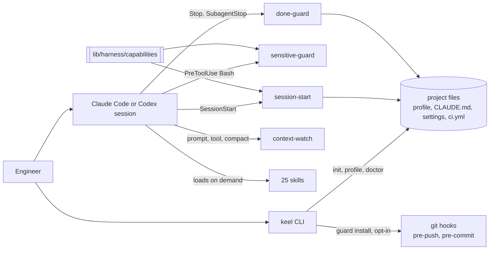

# Snapshot: keel

| | |
|---|---|
| Commit | `6d67084c6e1d271429cf76437ef99744f2eb807c` on branch `sandbox` |
| Default branch | `main`. `origin/main` is at the same commit; the local `main` branch is 256 commits behind it |
| Generated | 2026-09-25 |
| Scope | The whole repository, one deployable unit: the keel plugin, its CLI and its hooks |
| Confidence | medium. Every item in section 10 was run or read directly; sections 4 and 8 also carry subagent leads, marked where unverified |

> Regenerate with the `repo-snapshot` skill. Do not hand-edit: edits are lost on regeneration.
> Corrections belong in the section they correct, as a line starting `Correction:`.

This snapshot was commissioned as a gap review: what keel does today against its stated purpose,
making the same delivery process and coding standards the default in every AI-assisted session.
The remediation plan built from section 10 is
`docs/plans/2026-09-25-close-the-enforcement-gaps-from-the-snapshot.md`.

## 1. Project overview

keel is a Claude Code plugin plus a per-project bootstrap that makes a house delivery process the
default (README.md:1-3). It ships 25 skills, a bash CLI, and six hook scripts, and supports Codex
CLI at a lower tier (README.md:21-26).

| | |
|---|---|
| Type | Claude Code plugin, bash CLI, markdown skills |
| Languages | bash for the CLI and hooks, Python 3 for three helpers in `lib/`, markdown for skills |
| Version | 0.21.0 (VERSION:1) |
| Users | GBi engineering teams, installed per machine from the `gbi` marketplace |
| Maturity | active development. 659 commits since 2025-09-25, one maintainer, pre-1.0 by its own statement (README.md:6-7) |

## 2. Architecture summary

keel has three layers. Skills carry the process as markdown the model loads on demand. Hooks
registered by the plugin run at fixed session events and are the only part that acts without the
model choosing to. The `keel` CLI writes and checks the per-project files: `.keel/profile.json`,
a managed block in `CLAUDE.md` and `AGENTS.md`, `.claude/settings.json`, and a generated CI
workflow. A capability manifest decides which hook guarantee holds on which harness.



**Hook registration.** `hooks/hooks.json:3-95` registers SessionStart, UserPromptSubmit,
<!-- keel:claim gate=context-watch harness=claude --> <!-- keel:claim gate=sensitive-guard harness=claude -->
PreToolUse (all tools for context-watch, `Bash` only for sensitive-guard at hooks/hooks.json:43),
Stop, SubagentStop and PreCompact. No PostToolUse hook is registered.

<!-- keel:claim gate=sensitive-guard harness=claude -->
**Codex.** `hooks/hooks.codex.json` omits sensitive-guard. This is deliberate: sensitive-guard
requires an ask primitive (lib/harness/capabilities:118) that no Codex row provides.

<!-- keel:claim gate=done-guard harness=claude -->
**Critical path: an agent claims done.** The Stop hook runs done-guard, which reads the turn's
transcript, finds edits to non-documentation files, and looks for `verify.test` as a substring of
<!-- keel:claim gate=done-guard harness=claude -->
any Bash command in the turn (hooks/done-guard:32-36). With `gates.done_verified` at `required` it
blocks the stop (hooks/done-guard:364-366); otherwise it warns.

## 3. Repository structure

```
bin/keel             CLI, 2288 lines: init, new, doctor, profile, apex-export, scan, guard, version
bin/keel-fleet       doctor --json across many repositories
hooks/               the four hook scripts plus hooks.json and hooks.codex.json
lib/detect-stack.sh  stack and verify-command detection, 956 lines
lib/harness/         per-harness adapters and the capability manifest
lib/*.py             APEX export and render, context watchdog
skills/              25 skills, each a SKILL.md plus references/
templates/           profile schema, example profile, CLAUDE.md block
tests/               17 bash test files, validators, evals under tests/evals/
docs/                architecture, decisions, ideas, plans, PRDs, stories, audits, runbooks
```

Read first, in order: README.md, docs/01-architecture.md, docs/profile-keys.md, then the
dispatch table at `` bin/keel#init)        shift; cmd_init ``.

## 4. Feature analysis

| Feature | Entry point | What it does | Tests |
|---|---|---|---|
| Project setup | `` bin/keel#cmd_init() { `` | Detects the stack, writes profile, CLAUDE.md block, settings, and CI if none exists | tests/test-keel.sh |
| Profile editing | `` bin/keel#profile_set() { `` | Sets one dotted key; refuses unknown paths and init-owned keys | `` tests/test-keel.sh#profile set refuses a path the profile does not have `` |
| Health check | `` bin/keel#cmd_doctor_text() { `` | Checks profile, gates, guardrails, verify commands; runs them unless `--fast` | tests/test-keel.sh |
| Generated CI | `` bin/keel#write_ci() { `` | Test step, one step per non-null verify command, dependency audit, key-material check | `` tests/test-keel.sh#write_ci reaches every verify.* command `` |
| Git guard | `` bin/keel#cmd_guard() { `` | Opt-in pre-push scan and default-branch block, pre-commit gated on `gates.commit_guard` | tests/test-keel.sh |
| Session context | hooks/session-start | Injects the skill map and profile pointer | tests/test-session-start.sh <!-- keel:claim gate=session-start harness=claude --> |
| Sensitive paths | hooks/sensitive-guard | Asks before Bash touches a hard-blocked path; fails closed | tests/test-sensitive-guard.sh <!-- keel:claim gate=sensitive-guard harness=claude --> |
| Done check | hooks/done-guard | Blocks or warns when code was edited and the test command never appeared | tests/test-done-guard.sh <!-- keel:claim gate=done-guard harness=claude --> |
| Context watchdog | hooks/context-watch | Advises on context use; silent when python3 is absent | tests/test-context-watch.sh <!-- keel:claim gate=context-watch harness=claude --> |

**Which gates are mechanical.** `done_verified` is enforced by a hook. `commit_guard` is enforced
by a git hook only after `keel guard install`. `coding_standards` and `security_audit` are read
by skills and by `doctor`, and no hook asserts either (docs/profile-keys.md:54-55).

## 5. Development setup

Prerequisites: bash, git, python3, shellcheck. No package install.

```bash
tests/run-tests.sh                 # full suite, about 7 minutes, silent until each file ends
tests/test-keel.sh                 # one test file, per verify.test_one
shellcheck -x bin/keel bin/keel-fleet lib/*.sh lib/harness/*.sh tests/*.sh \
  tests/evals/run.sh tests/evals/stage.sh hooks/session-start hooks/context-watch \
  hooks/sensitive-guard hooks/done-guard
bin/keel doctor --fast             # the repository's own health check
```

Run on 2026-09-25: the full suite passes and the lint command exits 0 with no findings.
`bin/keel doctor --fast` on keel itself reports **1 problem**: three permission guardrails missing
from `.claude/settings.json`, see section 8.

## 6. Documentation assessment

| Artifact | Exists | Current | Accurate | Note |
|---|---|---|---|---|
| README | yes | yes | yes | Skill count and subcommands match the tree |
| Architecture | yes | yes | yes | docs/01-architecture.md:195-199 matches the hook registration |
| ADRs | yes | yes | yes | Seven, under docs/decisions/ |
| Profile key reference | yes | yes | partly | Documents gate values that nothing validates, see section 8 |
| Ideas backlog | yes | no | no | Six idea files still read `shaped` after the plans covering them completed |
| Coding standards | yes | no | partly | See "Standards adherence" in section 8 |
| Runbooks | yes | yes | unverified | Release and going-public runbooks not executed here |
| Snapshot | yes | yes | yes | This document, the first one |

Correction: as of 2026-09-26, the gate values the profile key reference documents are checked:
`keel profile set` refuses a value outside the schema's enum and `doctor` fails one (06b8ef2,
61360b3, plan tasks 1 and 2). The six idea files read `built` (be4ad29, task 8).

## 7. Missing documentation

| Missing | Path | Produced by |
|---|---|---|
| An ADR on in-session lint, whether a PostToolUse hook runs `verify.lint` after an edit | `docs/decisions/` | `design-architecture` |
| An ADR on enforcement in target-project CI, whether generated CI runs keel's own checks | `docs/decisions/` | `design-architecture` |

Correction: as of 2026-09-27, the in-session lint ADR is no longer missing, because no such hook
is being built (`docs/ideas/lint-after-each-edit.md`, declined). The target-project CI row is now
two ADRs, one for `keel scan` and one for the profile-loosening diff, and the standards-gate check
goes into `write_ci` with no ADR (`docs/ideas/keel-checks-in-target-ci.md`).

## 8. Technical debt

### Correctness risk

- **Gate values are never validated.** `profile set` accepts any string for a gate: run on
  2026-09-25, `keel profile set gates.security_audit reqired` exited 0 and wrote the typo
  (`` bin/keel#profile_set() { ``). `doctor --fast` on a profile holding `reqired` and `maybe`
  said nothing about either. The schema declares the enums (templates/profile.schema.json) but no
  runtime code loads it.

Correction: as of 2026-09-26, `profile set` refuses a value outside the schema's enum and `doctor`
fails a profile holding one, both reading the schema (06b8ef2, 61360b3, 3c3c306, plan tasks 1 and
2 with follow-up B). `null` is still accepted.

<!-- keel:claim gate=done-guard harness=claude -->
- **A misspelled gate weakens silently.** done-guard reads any value other than `off` and
  `required` as `warn` (hooks/done-guard:114, 364-367), so `requird` downgrades a blocking gate.

Correction: as of 2026-09-26, not silently: `doctor` fails such a value and `profile set` refuses
it (61360b3, 06b8ef2, tasks 1 and 2). The Stop hook still reads it as `warn`.

- **Generated CI ignores the default branch.** `write_ci` hardcodes `main` as the push trigger
  (`` bin/keel#write_ci() { ``). On a repository whose default branch is `master`, `keel init`
  recorded `master` in the profile and wrote a workflow that never runs on a push to it.

Correction: as of 2026-09-26, `write_ci` triggers on `conventions.default_branch`, falling back to
the repository's default branch without python3 (2d331ed, b36db4a, task 3 and follow-up A). A
workflow already written is not rewritten.

- **The gate that stops pushes is opt-in and unreported.** `keel init` does not install the git
  guard, and `doctor` does not report whether it is installed (`` bin/keel#cmd_doctor_text() { ``).
  This clone has no `core.hooksPath`, so keel itself runs without it.

Correction: as of 2026-09-26, `doctor` warns when `conventions.protect_default_branch` is not
false and the push guard is not installed, and prints an ok line when it is (63005ea, 433ee9b,
task 4 and follow-up C). `keel init` still does not install it. This clone runs the guard from
`.git/hooks` with no `core.hooksPath`, per
docs/plans/2026-09-26-guard-hooks-outside-the-working-tree.md.

### Change difficulty

- `bin/keel` is 2288 lines with inline Python heredocs; every CLI change lands in one file.
- `doctor` is at its budget of 10 python3 starts, asserted by
  `` tests/test-keel.sh#keel doctor starts python3 at most 10 times ``, so any new doctor check
  must share an existing interpreter start.

### Security posture

- **keel fails its own doctor.** `.claude/settings.json` lacks the `Bash(curl *)`, `Bash(wget *)`
  and `Bash(nc *)` ask rules that `keel_ask_rules` now writes (lib/harness/claude.sh:272). The
  file was last written by `keel init` before those rules existed.

Correction: as of 2026-09-26, `.claude/settings.json` has the three ask rules, and
`bin/keel doctor --fast` on keel reports no problems and 5 warnings (9fb2b3b, task 7).

- **`verify.security` is never detected.** detect_verify has no security branch for any stack
  (lib/detect-stack.sh:811), while init writes `gates.security_audit: required`
  (`` bin/keel#"security_audit": "required" ``). `write_ci` computes a dependency audit per
  package manager (`` bin/keel#npm)  audit='npm audit --audit-level=high' ``) but does not record
  it as `verify.security`, so `doctor` and `ship` never see it.

Correction: as of 2026-09-26, detect_verify sets `verify.security` for JavaScript and TypeScript
from an npm or pnpm lockfile or a yarn 2+ `yarn.lock`, and full `doctor` runs it, `--fast` does
not (2e0cb58, task 6). Every other stack still gets none.

- On Codex, hard-blocked paths are unprotected, by design and documented
  (docs/harness-support.md:12).

### Enforcement gaps against the stated purpose

- **"Lint after each file edit" is instruction only.** The injected block says it
  (templates/project-claude-md-block.md:37) and no hook runs lint during a session. The
  architecture puts lint at commit time behind an off-by-default guard
  (docs/01-architecture.md:199).
- **Python is not linted.** 2357 lines across `lib/*.py`, and the lint command covers shell only.

Correction: as of 2026-09-26, CI's `Python lint` job runs ruff over `lib/` with the rules
`E4,E7,E9,F` (817e509, task 10). The local lint command still covers shell only.

- **CI runs on Linux only** (.github/workflows/ci.yml:16). Stock macOS has no `timeout`, so
  `doctor` runs verify commands unbounded there (`` bin/keel#macOS ships neither ``); the Windows
  fixes in `9c68003` have no CI coverage.

Correction: as of 2026-09-26, CI also has an advisory `Tests on macOS` job (e242a88, task 9),
which has not yet run because nothing has been pushed. Windows still has no CI job.

- Evals cover 9 of 25 skills across 14 scenarios and run by hand before a release. Unverified
  count, from a subagent.

### Documentation drift

- Six idea files still read `Status | shaped` with `Next | write-plan`, although the plans that
  implemented them are fully ticked: docs/ideas/fleet-view-for-doctor.md:6,
  docs/ideas/incidents-do-not-feed-back-into-standards.md:6,
  docs/ideas/no-durable-provenance-record.md:6, docs/ideas/profile-loosening-goes-unnoticed.md:6,
  docs/ideas/write-ci-does-not-match-ship.md:6, and
  docs/ideas/coding-standards-audit-and-seed-modes.md:6.

Correction: as of 2026-09-26, all six read `built via` their plan, and three name the part left
open as Next (be4ad29, task 8).

- docs/ideas/windows-python3-detection-is-wrong.md has no status row, and the fix `9c68003` did
  not touch it.

Correction: as of 2026-09-26, it has a status row naming `9c68003` (be4ad29, task 8).

- `.keel/profile.json:2` records `keel_version` 0.18.0 against a 0.21.0 plugin; the file is
  maintained by hand per its own note.

Correction: as of 2026-09-26, it records `keel_version` 0.21.0 (9fb2b3b, task 7).

### Unverified leads

- Frontmatter of `debug` and `incident-response` overlaps on "production is broken"; the session
  prompt disambiguates, the frontmatter does not. unverified.
- No skill covers dependency upgrades, retrofitting tests onto untested code, or release notes.
  unverified.
- `.claude-plugin/marketplace.json` carries version 0.2.0; whether it should track the plugin
  version is unknown. unverified.
- Twenty-one commits from 2026-09-20 to 2026-09-22 are authored `test <test@example.com>`. The
  source is the machine's global git config, not keel's tests, which use `t@t.t`.

### Standards adherence

From the assessment at `docs/audits/2026-09-25-standards.md`, which reports coverage 41, house
defaults 9, backlog 3, sample 6, departures 4.

- None of the five applicable house topic references is folded in: observability, time and dates,
  resilience, API contracts and caching are all skipped whole, unchanged since the 2026-09-02
  assessment.
- `lib/apex_export.py:438-441` interpolates `schema.upper()` into a quoted SQL string, the gap the
  house parameterised-queries default exists to prevent. The value is the operator's own schema
  name, so the exposure is self-inflicted, and it is still a departure nobody recorded.
- Two departures have a stale basis: D-2 names a harness that has existed since the document was
  derived, and D-4 scopes python3 to one command while `have_python` gates at least eight sites.
- `execute-plan`'s subagent brief lives only in its references, against the document's rule that a
  dispatched brief stays in the body
  (`skills/execute-plan/references/subagent-prompts.md#Dispatch implementation and both reviews`).

## 9. Health metrics

| Metric | Value | Basis |
|---|---|---|
| Test coverage | 17 test files for 2 CLIs, 4 hooks, 8 lib scripts; no test executes `lib/harness/codex.sh`, and `lib/apex_render.py` has thin coverage | estimated, from a subagent's file map |
| Documentation coverage | 6 of 8 section 6 artifacts accurate | measured |
| Change difficulty | largest file `bin/keel` at 2288 lines | estimated |
| Dependency freshness | no runtime dependencies | measured |
| Bus factor | 1. One person authored 658 of 659 commits in the last year, under three identities | measured |
| CI health | 19 of the last 20 runs passed | measured, `gh run list` |

## 10. Recommendations

### Do first

1. **Validate gate and enum values.** A typo in a gate is accepted, reported as nothing, and read
   as a weaker gate. Fix: `tdd`, making `profile set` and `doctor` check values against the
   schema's enums. Effort: hours.

Correction: as of 2026-09-26, done in plan tasks 1 and 2 (06b8ef2, 61360b3, 3c3c306).

2. **Generated CI must run on the recorded default branch.** Any `master` repository initialised
   from now on would otherwise get CI that ignores pushes. Fix: `tdd` in `write_ci`. Effort: an
   hour.

Correction: as of 2026-09-26, done in task 3 and follow-up A (2d331ed, b36db4a).

3. **Make keel pass its own doctor.** Add the three missing ask rules and correct the stale
   `keel_version`. Fix: a direct edit, checked by `bin/keel doctor --fast`. Effort: minutes.

Correction: as of 2026-09-26, done in task 7 (9fb2b3b), which also installed the push guard here.

### Do soon

4. **Report the git guard in `doctor`.** Enforcement outside the agent exists but nothing says
   it is off. Fix: `tdd`, a warning when the repository protects its default branch and the
   guard is not installed. Effort: hours.

Correction: as of 2026-09-26, done as a WARN in task 4 and follow-up C (63005ea, 433ee9b).

5. **Correct the stale idea statuses.** Fix: `write-docs`. Effort: minutes.

Correction: as of 2026-09-26, done in task 8 (be4ad29).

6. **Run CI on macOS as well as Linux.** The maintainer's platform is untested in CI. Fix:
   `setup-deployment`. Effort: an hour plus a run.

Correction: as of 2026-09-26, added as an advisory job in task 9 (e242a88); its first run awaits a
push.

### Worth raising

7. **Decide in-session lint and CI-side keel checks.** Both are the difference between standards
   the agent is told about and standards that are checked, and both have costs recorded in
   decision 4 of doc 07. Fix: `design-architecture`, two ADRs. Effort: a day each to decide.

Also noted: `verify.security` detection from the package manager; a Python linter for `lib/`,
where ruff is the candidate as one binary with no config; a Windows CI job; the standards
assessment's remedies, which are folding in or departing from the five house references,
parameterising or allowlisting the APEX schema identifier, and rewriting departures D-2 and D-4,
all through `coding-standards`; skill coverage of dependency upgrades and test retrofitting;
wider eval coverage.

Correction: as of 2026-09-26, `verify.security` detection landed in task 6 (2e0cb58) for npm,
pnpm and yarn 2+ lockfiles, and ruff lints `lib/` in CI from task 10 (817e509).

The last security audit is docs/audits/2026-09-22-security.md; this review is not one.

**Not checked:** the release and going-public runbooks, the eval harness's results, the APEX
export path beyond the one line above, and whether the frontmatter overlaps mis-route in practice.

## 11. Proposed profile

| Key | Value | Confidence |
|---|---|---|
| `verify.test` | `tests/run-tests.sh` | detected, matches CI (.github/workflows/ci.yml) |
| `verify.test_one` | `tests/{name}` | as declared |
| `verify.lint` | the shellcheck string above | detected, exits 0; CI reads it from the profile |
| `verify.typecheck` | `null` | none exists |
| `verify.build` | `null` | nothing to compile |
| `verify.security` | `null` | the supply-chain scan runs in CI but is not declared here |
| `keel_version` | `0.21.0` | the profile says 0.18.0, which contradicts VERSION:1 |

Correction: as of 2026-09-26, the profile says `keel_version` 0.21.0 (9fb2b3b, task 7).
