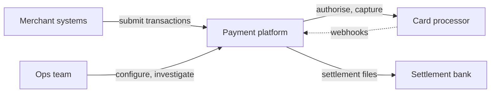
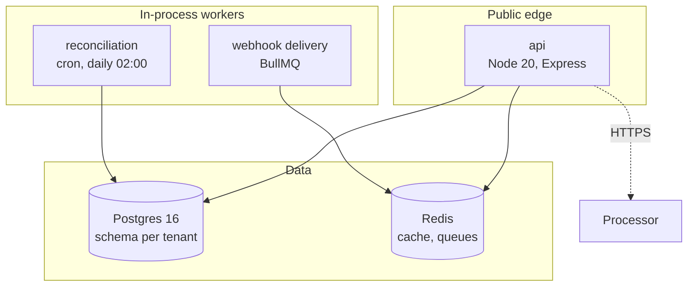
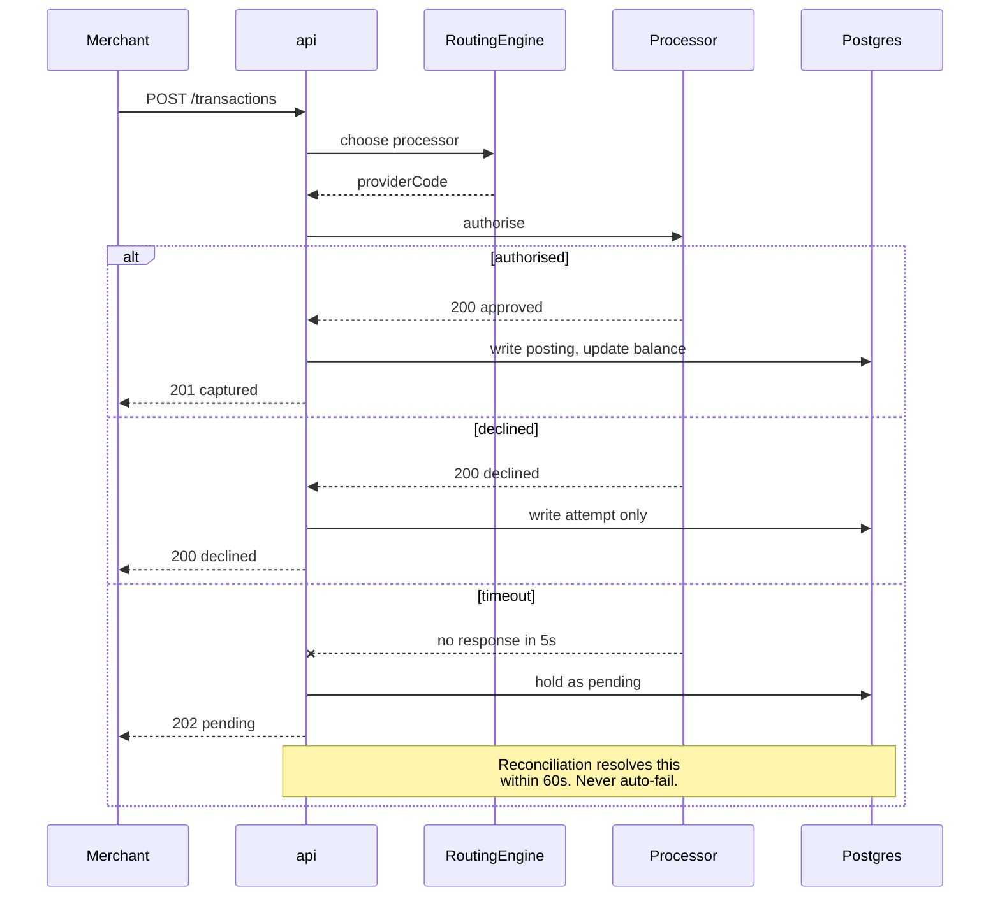
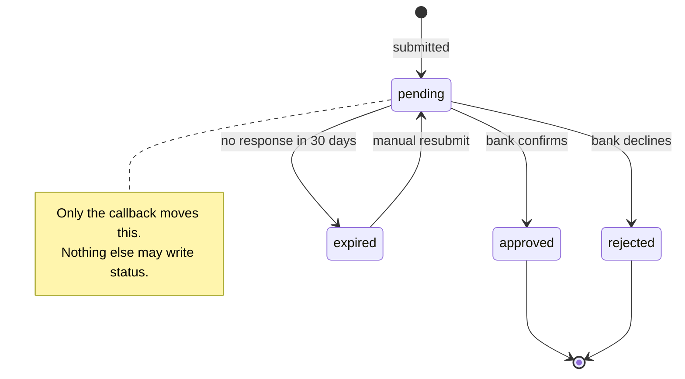
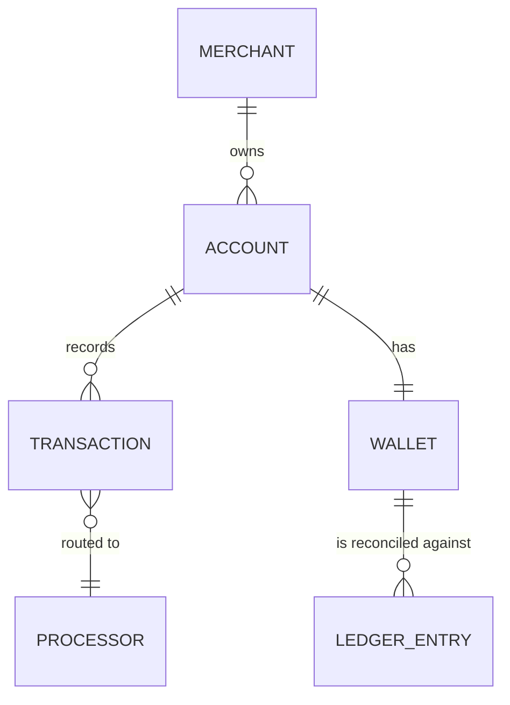

# Mermaid patterns

Diagrams are mermaid, always. They render in GitHub and GitLab, they diff as text, and they can
be regenerated. No image files, no draw.io exports, no screenshots of whiteboards.

Every block below has been rendered. Copy the shape rather than inventing syntax.

## Which diagram

| Question the reader has | Diagram |
|---|---|
| What is this system and who touches it? | Context (C4 level 1) |
| What runs, and what does it talk to? | Container (C4 level 2) |
| What happens during one operation? | Sequence |
| What states can this thing be in? | State |
| What does the data look like? | ER |
| What is the decision logic? | Flowchart |

One diagram per question. A diagram answering three questions answers none.

## Context

Who and what is outside the boundary. Deliberately coarse: one box for your system.

Dotted for inbound callbacks, so the direction of initiation is readable at a glance.

## Container

What actually runs. One node per deployable or datastore, labelled with its technology.

Say where the boundaries are with `subgraph`. If two things are in one process, put them in one
subgraph, because "in-process worker" and "separate service" are different operationally and the
diagram is where that gets confused.

## Sequence

For one critical path. Draw the failure branch; a sequence diagram with only the happy path
hides the design.

`alt` / `else` is how failure gets into a sequence diagram. Use `--x` for a call that does not
return, and a `Note` for the rule that governs the branch.

## State

For anything with a lifecycle, especially money.

Name the transition, never just draw the arrow. An unlabelled arrow is where bugs live.

## ER

Label every relationship. Cardinality alone does not say what the relationship means.

## Rendering gotchas

These break silently on GitHub. Each one has bitten a real document.

- **Quote any label containing punctuation.** `A[Node 20, Express]` breaks on the comma;
  `A["Node 20, Express"]` is fine.
- **Use ` ` for line breaks in labels.** A literal newline breaks the parse.
- **Avoid `end` as a node id.** It is a keyword.
- **Parentheses inside labels need quotes**, same as commas.
- **`stateDiagram-v2`, not `stateDiagram`.** The old renderer handles notes differently.
- **No markdown inside labels.** Backticks and asterisks render literally.

Before committing a document, confirm every block parses. A broken diagram in a design doc is
worse than none: it signals nobody read the file after writing it.
