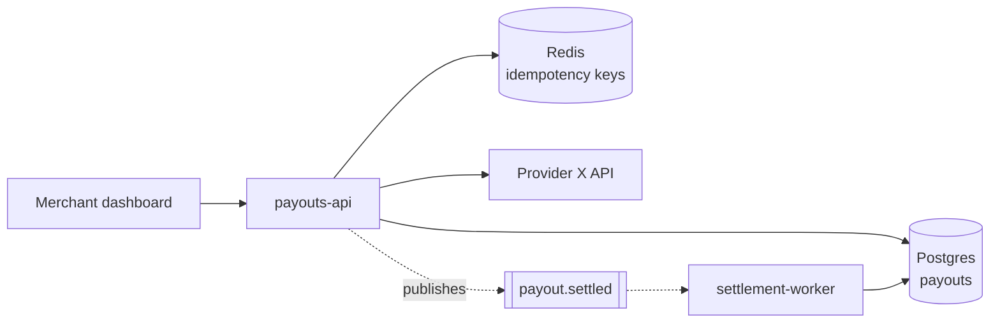

# Snapshot section templates

The structure of `<docs_root>/snapshot.md`. Eleven sections. Adapted from
`cursor-starter/documentation/repository-snapshot.md`, tightened so every claim carries
evidence.

## Evidence rules

These apply to every section and are the difference between a useful snapshot and a
plausible one.

1. **Cite or mark unknown.** Every factual claim gets a `path:line`, or the value is
   `Unknown`. There is no third option.
2. **Absent is a finding.** "No integration tests" is more useful than silence. Say it.
3. **Naming is not evidence.** A table called `refunds` does not prove refunds work. A route
   called `/v2/payouts` does not prove v1 is gone. Read the code or mark it `Unknown`.
4. **Contradictions get their own line.** Where the README, the code, and the CI config
   disagree, say all three and which one you believe.
5. **No recommendations inside sections 1 to 9.** Observations there, actions in section 10.
   Mixing them makes both harder to act on.
6. **Date and pin it.** The header records the commit the snapshot describes, so a reader can
   tell how stale it is.
7. **Verified or not recommended.** Nothing reaches section 10 that you did not verify yourself
   in step 3. An unverified observation belongs in section 8 with `unverified` next to it. A
   recommendation is a request for someone's afternoon, so it has to be right.
8. **Numbers come from commands, not from artifacts.** A committed coverage report, a badge, or
   a figure in a doc is a claim about the past. Run the command. Observed in practice: a
   committed report said 1.94% statement coverage where the real figure was 23.29%, because the
   artifact predated most of the test suite.

## Header

```markdown
# Snapshot: <repo or unit name>

| | |
|---|---|
| Commit | `<full sha>` on branch `<branch>` |
| Default branch | `<name>`, and whether it matches the commit above |
| Generated | YYYY-MM-DD |
| Scope | <the deployable unit this covers, and which of N it is> |
| Confidence | high / medium / low, with one line on what limits it |

> Regenerate with the `repo-snapshot` skill. Do not hand-edit: edits are lost on regeneration.
> Corrections belong in the section they correct, as a line starting `Correction:`.
```

The confidence line is not decoration. "Low, no tests exist so behaviour is inferred from
reading only" tells a reader how much weight to put on section 4.

**When the default branch differs from the commit you snapshotted, say so here and again in
section 8.** Observed in practice: a service whose remediation lived on an unmerged branch,
while its default branch still had every line of its security configuration commented out.
Nothing else in the snapshot mattered as much as that one row.

## 1. Project overview

Name, one-sentence purpose, project type (service, library, CLI, frontend, job), the
languages and frameworks with versions, who uses it, and maturity.

Maturity is one of: `prototype`, `active development`, `stable`, `maintenance`, `abandoned`.
Justify it from commit recency and contributor count, not from how the code looks.

**In a monorepo, add a "Position in the platform" paragraph:** the sibling units, their file
counts, which are real and which are stubs, and what this unit depends on. A unit snapshot read
without that context invites the reader to assume the unit is the whole system. Observed in
practice: a platform whose processor integration was documented as a separate service, built
inside the backend instead, while the named service directory held two files and no source.

## 2. Architecture summary

The shape of the system, in prose no longer than 200 words, followed by a container diagram.

```markdown

```

Then: key components and their responsibilities, the request path for the single most
important operation, external dependencies with what breaks when each is down, and the
architectural patterns actually in use. Name a pattern only where the code follows it. Half
an implemented hexagonal architecture is a finding, not a pattern.

Add a sequence diagram for the one critical path a newcomer must understand. One, not five.

## 3. Repository structure

A tree pruned to what matters, two or three levels deep, with a purpose per entry. Do not
paste the output of `tree`. Then: the files to read first, in order, to understand the
system, and where configuration lives.

## 4. Feature analysis

What the system does, from reading handlers rather than route names. Per feature: what it
does, its entry point at `path:line`, and whether tests cover it.

Include the API surface as a table (method, path, purpose, auth required), the data model
with relationships, and how authentication and authorisation actually work, including where
the check happens and what happens when it fails.

Mark any feature you could not verify as `Unknown: <what you would need to read>`.

## 5. Development setup

Prerequisites with versions, the exact commands to get from clone to running, the commands
to run tests and lint, and how a developer works day to day.

**Run the setup steps if you can.** A setup section nobody has executed is a guess. Where a
step fails, record the failure and the fix. This is the section that most often turns out to
be wrong, and the one a new joiner hits first.

## 6. Documentation assessment

Per artifact: does it exist, is it current, and is it accurate. Being current and being
accurate are different failures.

| Artifact | Exists | Current | Accurate | Note |
|---|---|---|---|---|
| README | yes | no | partly | Setup section references a removed `make bootstrap` |
| API docs | no | | | |
| ADRs | no | | | Three material decisions are undocumented, see section 8 |
| Runbook | yes | yes | unverified | Rollback steps never tested |
| Inline docs | | | | Public functions documented in `src/domain`, absent in `src/http` |

## 7. Missing documentation

What is missing, where it should live, and which skill produces it. Keep to what is genuinely
absent and would be used.

Paths are relative to `profile.docs_root`, which defaults to `docs/keel` but does not always
resolve there. Read it from the profile rather than assuming, and never write a hardcoded
`docs/keel` path into the document.

| Missing | Path | Produced by |
|---|---|---|
| PRD | `<docs_root>/prd/payouts.md` | `write-prd` in `from-repo` mode |
| ADRs for the three undocumented decisions | `<docs_root>/decisions/` | `design-architecture` |
| Deploy runbook | `<docs_root>/runbooks/deploy.md` | `setup-deployment` |
| Coding standards | `<docs_root>/standards.md` | `coding-standards` |

## 8. Technical debt

Observations only, with evidence and impact. Group by kind: correctness risk, change
difficulty, performance, security posture, scaling limits, dependency health.

Per item: what it is, `path:line`, and what it costs. "This will be painful to change" is not
an observation. "Adding a payout provider requires edits in 7 files because the provider
switch is a `switch` statement in `payout.service.ts:412`" is.

**This section holds the unverified findings.** Anything a subagent reported that you did not
confirm in step 3 lives here with `unverified` against it, never in section 10. Being explicit
about which findings are second-hand is more useful than a uniform tone of confidence, because
it tells the reader which ones to check before acting.

Dependency health belongs here: count of outdated majors, anything unmaintained, anything
with a known advisory. Do not attempt a security audit; that is `security-audit`. Note what
you noticed and move on.

## 9. Health metrics

Use this rubric. Every value is `measured`, `estimated`, or `unmeasured`, and the word
appears in the output. An estimated score with its basis stated is useful; a bare number is
not.

| Metric | How to establish it |
|---|---|
| Test coverage | Run the coverage command if one exists, and report `measured`. Otherwise report test file count against source file count, and which areas have no test file at all, as `estimated` |
| Documentation coverage | Count of section 6 artifacts that exist and are accurate, over the total. `measured` |
| Change difficulty | Largest files by line count, deepest import chains, and count of files that changed together in the last 100 commits. `estimated` |
| Dependency freshness | Outdated majors over total direct dependencies. `measured` |
| Bus factor | Contributors with more than 10% of commits in the last year. `measured` |
| CI health | Pass rate over the last 20 runs where visible, otherwise `unmeasured` |

Never produce an overall score out of 10. It compresses away the only part anyone can act on.

## 10. Recommendations

The only section with actions. Ordered by value over effort, not by severity. Each names the
skill that does the work, so the reader's next step is one invocation.

**Where the gap is a missing tool, name the tool and one reason**, from
[../../keel/references/tool-choices.md](../../keel/references/tool-choices.md), keyed on
`profile.stack.language`. "No tests here, fix: `tdd`" leaves the reader to choose a runner before
they can start. Three new tools is the most one document may propose, and a repository with a
working equivalent has no gap: 2,000 passing Jest tests is a test runner, and recommending Vitest
there is a migration proposal rather than a finding.

Every item here was verified in step 3. If you find yourself writing "this appears to" or
"the code suggests", the item belongs in section 8 instead.

```markdown
### Do first
1. **The setup instructions do not work.** `make bootstrap` was removed in `a1b2c3d` but the
   README still references it, so every new joiner is blocked on day one.
   Fix: `write-docs`, README mode. Effort: minutes.

### Do soon
2. **No tests on the settlement path.** `src/settlement/` has no test file, and it moves
   money. Fix: `tdd`, retrofitting tests before the next change there. Tool: Vitest, which reads
   the bundler config already here and needs no transform layer for TS. Effort: a day.

### Worth raising
3. **Provider dispatch is a switch statement** at `payout.service.ts:412`, so adding a
   provider touches 7 files. Fix: `refactor`, but only when a second provider is actually
   scheduled. Effort: half a day. Do not do this speculatively.
```

Cap at seven items. A list of twenty gets read as a list of zero. Anything below the cut goes
in one line under `Also noted`.

**Name two or three actions in the handoff**, not seven. The cap above is what the document may
contain; this is what a reader can act on today.

**Two items are required on a first look at an unfamiliar repository**, because this skill
deliberately does not do either job and a document that omits them reads as a clean bill of health:

- `security-audit --full`, whose own scope line names this exact moment: a new engagement. Section 8
  records what you noticed in passing; it is not an audit and must not be presented as one.
- `coding-standards`, to establish what this repository's conventions are, and where they are not
  written down anywhere.

Then close the document with one line naming what this snapshot did not check, in the same place
every time, so a reader who skips to the end still sees it. `security-audit` already carries this
rule as "say plainly what you did not cover"; the asymmetry was accidental.

## 11. Proposed profile

What agents D and E found, in the shape `.keel/profile.json` expects, so `keel init` can
consume it. Mark every uncertain value.

```markdown
Detected, for `.keel/profile.json`:

| Key | Value | Confidence |
|---|---|---|
| `stack.language` | typescript | detected from `tsconfig.json` |
| `stack.framework` | nestjs | detected from `package.json` |
| `verify.test` | `npm test` | detected, and it runs green |
| `verify.test_one` | `npm test -- {path}` | inferred, not verified |
| `verify.typecheck` | `null` | no typecheck script exists. Recommend adding one |
| `deploy.target` | gcp-cloud-run | detected from `.github/workflows/deploy.yml:34` |
| `deploy.envs` | dev, prod | detected. No staging, which contradicts the README |
```

That last row is the pattern to aim for. A contradiction surfaced here saves an afternoon
later.
